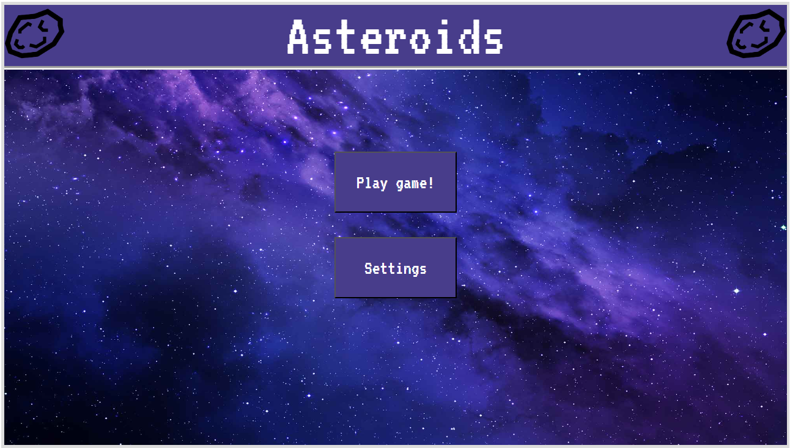
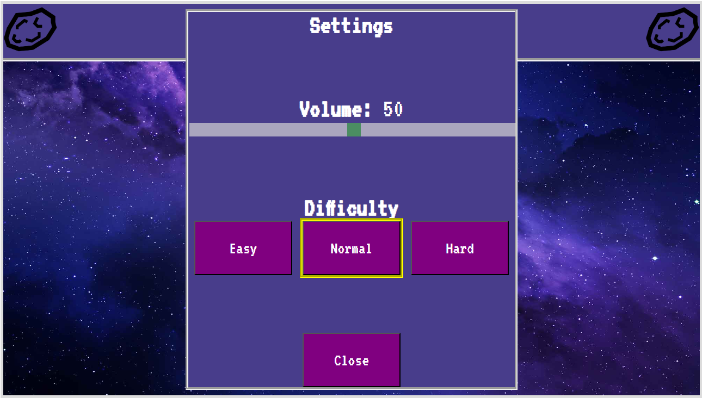
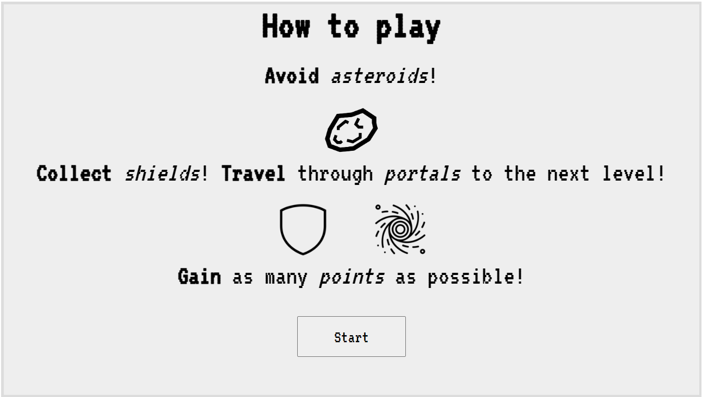

EECS 493 Assignment 2: Asteroids Main Menu
======================================

| Total     | Released | Due                         |
| --------- | -------- | --------------------------- |
| 65 points | 1/16   | 1/26 11:59 PM    |

## Submission Instructions

Please submit your work to Canvas as a zip file, named `a2_<uniqname>.zip`. Replace `<uniqname>` with your uniqname: e.g. `a2_zhaojer.zip`, note that the angle brackets should NOT be included in your filename. Renaming (e.g., "-1") done by Canvas is fine.

This zip file should have a *single directory* containing *all files and directories* provided in the starter code. In other words, the zip file should have the following structure.

```console
a2_uniqname
├── index.html
├── scripts
│   ├── jquery.min.js
│   └── page.js
├── src
│   ├── asteroid.png
│   ├── frontpage_background.jpg
│   ├── port.gif
│   └── shield.gif
└── style
    └── index.css
```

Not following the upload instruction will result in a penalty.

## Objective

The objective of this assignment is for you to gain practical experience in building a single-page web application with HTML, CSS, and a little bit of JS (jQuery). Specifically, you will be creating the main menu of a game. No external library or framework, other than jQuery, is allowed.

Watch this video for an overview of Assignment 2: [https://youtu.be/ubacBgC7YBo](https://youtu.be/ubacBgC7YBo)

Watch this video for an overview of both Assignment 2 and 3: [https://youtu.be/waDMWIfT8yg](https://youtu.be/waDMWIfT8yg)

## Grading Breakdown

This assignment has 3 main components (denominator of 65 points):

1. A landing page - *25 points*
2. A settings panel - *25 points*
3. A tutorials page - *15 points*

## Starter Code

You will use the starter code we provide to complete this assignment.

Download and unpack the starter files (either using the following commands or simply navigating to the link).

```console
$ wget https://eecs493staff.github.io/a2-asteroids-menu/starter_code.tar.gz
$ tar -xvzf starter_code.tar.gz
```

Here's a brief description of each of the starter files.

| `index.html` | Some base containers (divs) for the game window are defined; write your HTML code here |
| `style/index.css` | Some stylings for the game window are defined; write your CSS code here |
| `scripts/page.js` | Some helpful comments are provided; write your JS code here |
| `scripts/jquery.min.js` | jQuery library source code; do NOT modify |
| `src/` | Images to display on your website; do NOT modify |

Remarks:

- You aren’t required to use the starter code, but it’s there to help you.
- Please refer to Piazza for any modifications and clarifications.
- Please make sure that your application (webpage) behaves properly on the latest version of Google Chrome. Your graders will use Chrome.

## Helpful Resources

Before starting with this assignment, we recommend that you check out the following resource that will make your progress in this assignment much easier.

This is a recording of a group office hour session from Fall 2022, which contains an overview of both Assignment 2 and Assignment 3, how to start, and some challenging aspects students had questions about.

The video is 2 hours long, but only the portion from 29:30 to 1:07:30 is relevant for Assignment 2. Timestamp is provided in the video description.

Recording link: [https://youtu.be/hXilQo1lMjE](https://youtu.be/hXilQo1lMjE)

## Screenshots

### Landing Page



### Settings Panel



### Tutorial Page



## Requirements

We outline the requirements for each of the components below. **Everything listed in this section, unless labeled as "Suggested", is required.** The demo video & screenshots may be helpful in understanding the website; however, your website does NOT need to look exactly like them.

### General

- Only use one HTML file, `index.html`. *-10 points off if not followed.*
- Do all styling/layout in a separate CSS file, `index.css`. *-10 points off if not followed.*
    - Remark: `<b>` and `<i>` tags count as inline styling. Do not use them.
    - Moderate use of `<br>` tags are ok.
- Do all JavaScript code in a separate JS file, `page.js`. *-10 points off if not followed.*
    - Registering event listeners for an HTML element inline is ok.
- Use relative paths for images. *-10 points off if not followed.*

### Landing Page (25 points)

#### Main Components

- a background image
- an "Asteroids" header
- two buttons, "Play game!" and "Settings", that transition to the correct corresponding screen when clicked (Need JavaScript)
    - "Play game!" transitions to Tutorials Page
    - "Settings" transitions to the Settings Panel

#### Required

- When you first load the HTML page, the landing page should be shown
- Use the background as it appears from the [screenshot](#landing-page) above
- Header should be at the top and span the entire width of the game window
- The text "Asteroids" should be horizontally centered
- Asteroid gifs should appear on the left and right side of the header; they should also have the same height as the header while retaining their original width/height ratio
    - Hint: [CSS Flexbox](https://www.w3schools.com/css/css3_flexbox.asp) ([Flexbox Froggy](https://flexboxfroggy.com) is a great website to learn about Flexbox)
- Both buttons must appear within the game’s border and be horizontally centered and aligned
- Text in the buttons should be horizontally and vertically centered
- There should be some space between the first button and the bottom of the header, and some space between the two buttons

#### Suggested Style

Header:

```css
height: 100px;
background-color: darkslateblue;
border-bottom: 6px groove;
font-size: 100px;
color: white;
```

Button:
```css
width: 200px;
height: 100px;
background-color: darkslateblue;
color: white;
```

### Settings Panel (25 points)

#### Main Components

- 3 headings ("Settings", "Volume:", "Difficulty")
- a slider under the "Volume:" heading to adjust the volume of the game
    - default: 50
- 3 buttons under the "Difficulty" heading to select the difficulty level
    - default: Normal
- a close button that transitions back to the landing page (Need JavaScript)
- Settings should remain the same after closing the panel

#### Required

- The Settings Panel
    - should have `width: 600px; height: 690px;`
    - should be displayed within the game's border
    - should be centered both vertically and horizontally
- All 3 headings should be bolded and horizontally centered
    - Remark: The volume number, e.g. 50, is NOT bolded
- The slider has a range of 1 to 100 (inclusive); as the user drags the slider left and right, the current volume number based on the positioning of the slider should be updated next to the "Volume:" label.
    - Hint: [How To Create Range Sliders](https://www.w3schools.com/howto/howto_js_rangeslider.asp) (Need JavaScript)
- The three difficulty buttons
    - have the same size (height/width)
    - are labeled "Easy","Normal", and "Hard" respectively
    - are vertically aligned and evenly spaced horizontally
- There is a distinct border around the difficulty that is currently selected
- When clicking a Difficulty button, the border should change indicating that it has been selected (Need JavaScript)
- The close button should be horizontally aligned with the middle difficulty button (i.e. the "Normal" button)

#### Suggested Style

Slider:

```css
width: 100%;
height: 25px;
background: #d3d3d3;
outline: none;
opacity: 0.7;
transition: opacity .2s;
```

Button:

```css
background-color: purple;
width: 180px;
height: 100px;
color: white;
```

### Tutorials Page (15 points)

#### Main Components

- All the texts and gifs as shown in the [screenshot](#tutorial-page) above
- A "Start" button (that doesn’t need to lead anywhere, yet)

#### Required

- "How to play" is bolded
- "Avoid", "Collect", "Travel", "Gain" are bolded
- "asteroids", "shields", "portals", "points" are italicized
- All components (texts, gifs, button) are horizontally centered on screen
- There should be some space between each component
- The images should retain their original aspect ratio

#### Suggested Style

Images

```css
width: 100px;
```

"How to play" font size

```css
font-size: 75px;
```

Other texts font size

```css
font-size: 50px;
```

Buttons

```css
width: 200px;
height: 75px;
```

Background

```css
background-color: gainsboro;
```

## FAQ

### Do I need to create additional files other than the ones provided in the starter code?

No. You should write all of your code in `index.html`, `style/index.css`, and `scripts/page.js`.

### What is the recommended development environment for the assignments?

We recommend using any text editor (e.g. VSCode) and directly opening your `index.html` file in Google Chrome to test your code. You do not need any additional extensions (e.g. Live Server).

### What are relative paths vs. absolute paths?

Relative paths begin with the current directory `.`, whereas absolute paths begin with the root directory `/`. Read more in [this article](https://www.geeksforgeeks.org/absolute-relative-pathnames-unix/).

### Can I use sample code from W3Schools?

Yes.

### Can I apply additional CSS styling in my game?

Yes! As long as they do not conflict with any of the required styles mentioned in the spec.

### Are we required to use jQuery (e.g. for things like event listeners)?

No, you are not required to use the jQuery library. However, using it will make it much easier to complete this (and the next) assignment.

### Are we allowed to use `<span>`, `<strong>`, `<em>`, `<h1>` tags?

Yes.

### Is it OK if some elements briefly appear and then disappear upon opening `index.html`?

Yes.

## Acknowledgments
Original spec written by Zirui Zhao <zhaojer@umich.edu>.
Updated by the EECS 493 team.

This document is licensed under a [Creative Commons Attribution-NonCommercial 4.0 License](https://creativecommons.org/licenses/by-nc/4.0/). You're free to copy and share this document, but not to sell it.  You may not share source code provided with this document.
