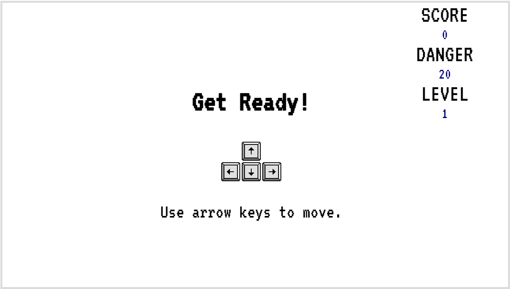
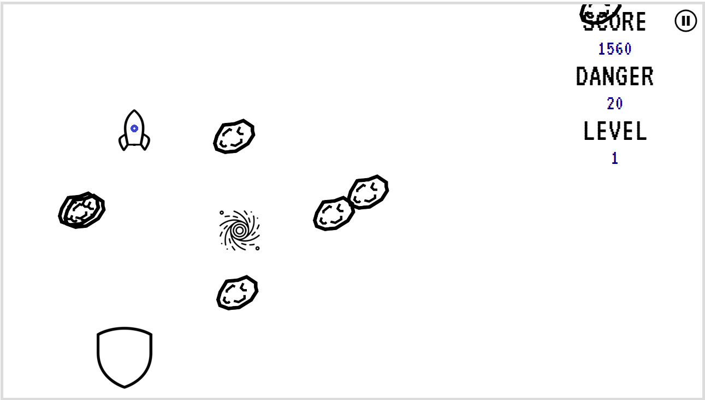
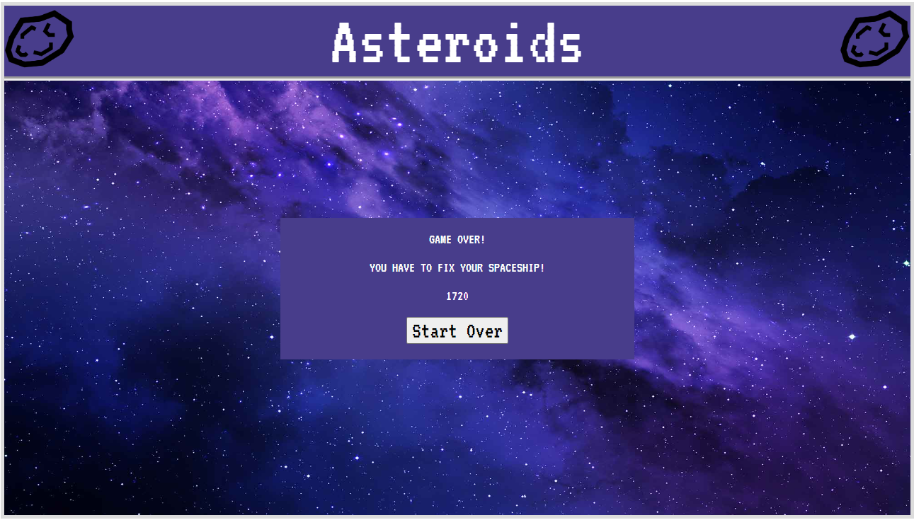
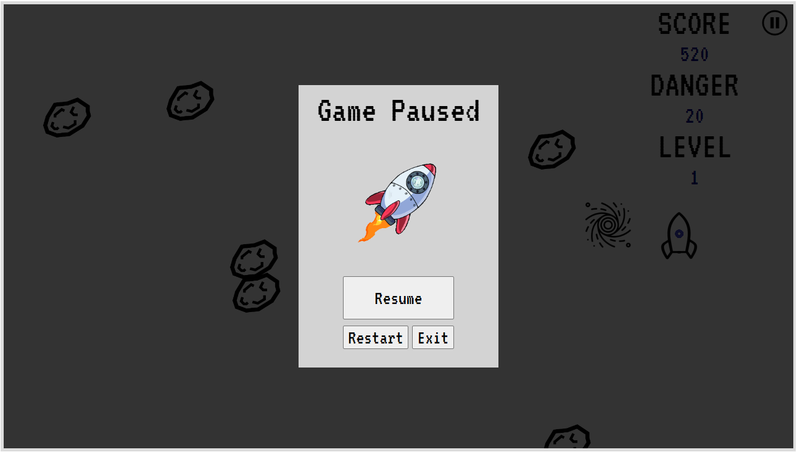
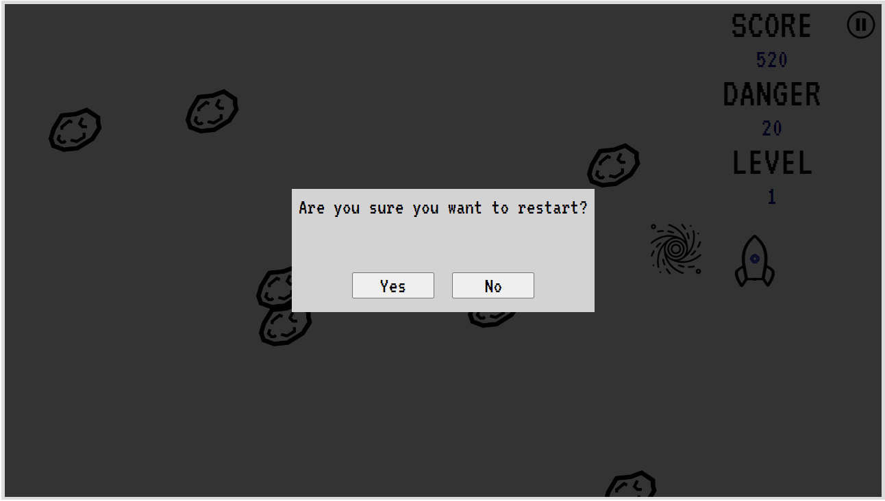
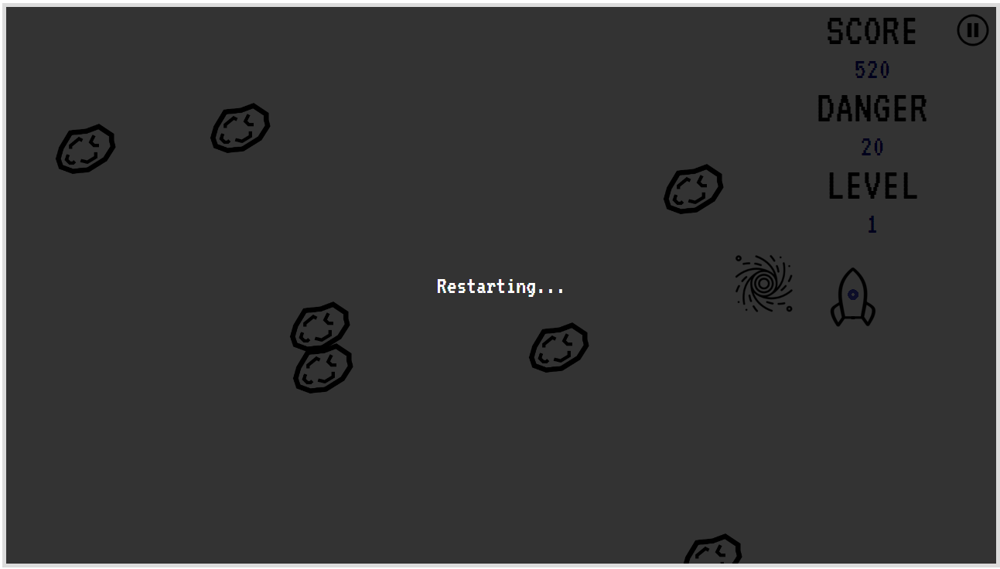

EECS 493 Assignment 3: Asteroids Game
======================================

| Total     | Released | Due                         |
| --------- | -------- | --------------------------- |
| 125 points| 1/23    | **2/9 at 11:59 PM ET**    |

## Submission Instructions

Before submitting, please ensure your website loads in Google Chrome by simply clicking and opening the `index.html` without using server hosting tools (e.g. VS Code Live Server).

Please submit your work to Canvas as a zip file, named `a3_<uniqname>.zip`. Replace `<uniqname>` with your uniqname: e.g. `a3_zhaojer.zip`, note that the angle brackets should NOT be included in your filename. Renaming (e.g., "-1") done by Canvas is fine.

This zip file should have a *single directory* containing *all files and directories* provided in the starter code. In other words, the zip file should have the following structure.

```console
a3_uniqname
├── index.html
├── scripts
│   ├── jquery.min.js
│   └── page.js
├── src
│   ├── arrowkeys.png
│   ├── asteroid.png
│   ├── audio
│   │   ├── collect.mp3
│   │   └── die.mp3
│   ├── frontpage_background.jpg
│   ├── pause-rocket.gif
│   ├── pause.png
│   ├── player
│   │   ├── player.gif
│   │   ├── player_down.gif
│   │   ├── player_left.gif
│   │   ├── player_right.gif
│   │   ├── player_shielded.gif
│   │   ├── player_shielded_down.gif
│   │   ├── player_shielded_left.gif
│   │   ├── player_shielded_right.gif
│   │   ├── player_shielded_up.gif
│   │   ├── player_touched.gif
│   │   └── player_up.gif
│   ├── port.gif
│   └── shield.gif
└── style
    └── index.css
```

Not following the upload instruction will result in a penalty.

## Objective

The objective of this assignment is for you to gain practical experience in building an interactive single-page web application with HTML, CSS, and JavaScript/jQuery. Specifically, you will be creating a game called "Asteroids" as outlined in this spec. No external library, other than jQuery, is allowed.

Watch this video for an overview: [https://youtu.be/FeEbwuNbsiI](https://youtu.be/FeEbwuNbsiI)

## Grading Breakdown

This assignment has 8 main components (denominator of 125 points):

1. Overall Functionality - *10 points*
2. "Get Ready" Splash Screen - *5 points*
3. Asteroids - *25 points*
4. Shields and Portals - *15 points*
5. Rocket - *20 points*
6. Scoreboard - *5 points*
7. Sounds - *5 points*
8. Game Over Page - *10 points*
9. Pause - *15 points*
10. Resume - *5 points*
11. Exit - *3 points*
12. Restart - *7 points*

## Starter Code

You will use the starter code we provide to complete this assignment.

Download and unpack the starter files (either using the following commands or simply navigating to the link).

```console
$ wget https://eecs493staff.github.io/a3-asteroids/starter_code.tar.gz
$ tar -xvzf starter_code.tar.gz
```

Here's a brief description of each of the starter files.

 <table>
  <tr>
    <td><code>index.html</code></td>
    <td>Some containers (divs) for the game window and the game board are defined; write your HTML code here</td>
  </tr>
  <tr>
    <td><code>style/index.css</code></td>
    <td>Some stylings for the game window, game board, and images are defined; write your CSS code here</td>
  </tr>
  <tr>
    <td><code>scripts/page.js</code></td>
    <td>Here is a list of things provided:
    <ol><li>Some comments describing the structure of the code</li><li>Some global variables for storing game states/data</li><li>An Asteroids class is defined (Asteroids that are randomly generated and travels linearly across the gameboard)</li><li>Event handler for arrow key presses</li><li>Additional helper functions (e.g. determining collision);</li></ol>
    write your JS code here
    </td>
  </tr>
  <tr>
    <td><code>scripts/jquery.min.js</code></td>
    <td>jQuery library source code; do NOT modify</td>
  </tr>
  <tr>
    <td><code>src/</code></td>
    <td>Images and audios for your website; do NOT modify</td>
  </tr>
</table>

Remarks:

- You will need to import all your Assignment 2 code into Assignment 3 starter code.
    - See [Overall Functionality](#overall-functionality-10-points) section for details
- You may choose to not use the starter code and implement those functionalities yourself.
- Please check Piazza for any modifications and clarifications.
- Make sure that your application behaves properly on the latest version of Google Chrome. Your graders will use Chrome.

## Helpful Resources

Before starting with this assignment, we recommend that you check out the following 2 resources that will make your progress in this assignment much easier.

### Group OH

This is a recording of a group office hour session from Fall 2022, which contains an overview of both Assignment 2 and Assignment 3, how to start, and some challenging aspects students had questions about.

The video is 2 hours long: Everything, except the portion from 29:30 to 1:07:30, is relevant for this assignment. Timestamp is provided in the video description.

Recording link: [https://youtu.be/hXilQo1lMjE](https://youtu.be/hXilQo1lMjE)

### Blaster Game Demo

This demo is on creating a simple game with JS from many semesters ago. It goes over some common JS functions for manipulating the DOM, which are important for this current assignment too. The demo is about 45 minutes.

Blaster Game Video: (Consider downloading for better quality! Captions have been added also.) https://drive.google.com/file/d/1ttQV8_Wzm37cXrbEYuBXPAixG_UzQNFZ/view?usp=sharing

Blaster Game Starter Code: https://drive.google.com/file/d/1r5YC7vx_9l5GBzTYRpGE-5ewFbGN12Lk/view?usp=sharing

## Screenshots

### "Get Ready" Splash Screen



### Gameplay & Scoreboard



### Game Over Page



### Pause Screen



### Restart Confirmation



### Restarting



The remaining pages are the same as Assignment 2.

## Requirements

We outline the requirements for each of the components below. **Everything listed in this section, unless labeled as "Suggested", is required.** The demo video & screenshots may be helpful in understanding the game; however, your game does NOT need to look exactly like them.

### General

- Only use one HTML file, `index.html`. *-10 points off if not followed.*
- Do all styling/layout in a separate CSS file, `index.css`. *-10 points off if not followed.*
    - Remark: `<b>` and `<i>` tags count as inline styling. Do not use them.
    - Moderate use of `<br>` tags are ok.
- Do all JavaScript code in a separate JS file, `page.js`. *-10 points off if not followed.*
    - Registering event listeners for an HTML element inline is ok.
- Use relative paths for images. *-10 points off if not followed.*

### Overall Functionality (10 points)

- All of Assignment 2 features are present
    - The landing page, the settings panel, and the "how to play" page are all present and are working correctly (as defined in Assignment 2 spec)
    - The transitions between these 3 pages are correct (as defined in Assignment 2 spec)
- Assignment 2 features are correctly integrated into this assignment
    - "How to play" Page
        - This page should only be displayed on the first time the user plays the game
        - Clicking on the "Start" button now transitions to the "Get Ready" splash screen
    - Landing Page
        - Clicking on the "Play game!" button transitions to the
            - "How to play" Page, if this is the first time the user plays the game
            - "Get Ready" splash screen, otherwise
    - Settings Panel
        - Adjusting the settings (i.e. volume and difficulty) should be actually reflected in the gameplay (see above sections for more details)
        - The settings should stay the same after closing the settings panel (i.e. including going to other pages, playing the game, etc.)
- Player should be able to play the game multiple times without issues (without reloading the page)
    - i.e. All features should still be functional when repeatedly playing the game
    - Common examples of some features not working properly on a second playthrough of the game:
        - asteroids, portals, or shields stop spawning
        - rocket does not move
        - certain buttons stop functioning
        - etc.
    - Points will be deducted from their corresponding rubric items when the feature doesn't work when playing the game a second time

### "Get Ready" Splash Screen (5 points)

#### Main Components

- All items and texts as shown in [the screenshot](#get-ready-splash-screen)
- A scoreboard visible on the top right corner with the correct values

#### Required

- This screen is shown right before the player enters the gameplay
- This screen disappears and transitions to the gameplay in 3 seconds
- The items (besides the scoreboard) should be horizontally centered

#### Suggested Style

- "Get Ready" font size: 75px
- text font size: 50px
- font color: black
- img size: original size

### Asteroids (25 points)

- Asteroids should appear randomly from the side of the board, move through the board linearly, and disappear once they reach the other side of the board.
    - Both the start and end location of the asteroid should be random.
- The speed and spawn rate of the asteroids change depending on the difficulty.
    - Easy:
        - Spawn rate: every 1000 milliseconds
        - Speed: 1x
    - Medium:
        - Spawn rate: every 800 milliseconds
        - Speed: 3x
    - Hard:
        - Spawn rate: every 600 milliseconds
        - Speed: 5x
- The exact speed for each difficulty is up to you.
- At the beginning of the game, the asteroid's speed for medium should be 3 times faster than the asteroid's speed for easy, and the asteroid's speed for hard should be 5 times faster than the asteroid's speed for easy.
- Every time the level increases (i.e. when the player goes through a portal, see next section), the asteroid's speed increases by a certain constant multiple.
    - You may choose whether the speed of the already-existing asteroids increases or not. But the speed of the newly-created asteroids (i.e. asteroids that are about to appear) has to increase.
- You can implement the asteroids to have the same speed, or have them so that they all reach their destination in the same amount of time. Either is fine.
- The asteroids can overlap each other on the board.
- To save you time, the majority of the requirements here are already implemented for you, and the remainder can be easily implemented using methods of the Asteroid class.
- Asteroid Suggested Style: height: 62px; width: 62px;

### Shields and Portals (15 points)

- A portal spawns every 6 seconds and disappears 3 seconds after it was spawned.
- A shield spawns every 9 seconds and disappears 3 seconds after it was spawned.
- These spawning intervals guarantee that there will *never* be more than one portal or more than one shield appear on the screen at the same time.
- The location of the portal and shield on the board is random and should be contained entirely within the dimensions of the board.
- It is okay for the portals and shields to appear over the scoreboard.
- The asteroids, portals, shields, and rocket should all roughly appear to be around a similar size.

### Rocket (20 points)

- The rocket is controlled by the player, whose goal is to travel through portals and avoid being hit by asteroids.
- The rocket should not be moving "behind the scenes" when it is not visible on the screen (i.e., when it is not on the gameplay page).
- The rocket moves up/down/left/right, controlled by the keyboard arrow keys.
- The rocket can only move within the game board and should not be able to exit the board.
- When the rocket comes into contact with an asteroid without a shield:
    - Change the rocket's image to "player_touched.gif" and play the "die" audio.
    - The rocket and all asteroids should immediately stop moving, and stay at their current position for 2 seconds.
    - Then, transition to the "game over" page.
- When the rocket comes into contact with an asteroid with a shield:
    - The rocket loses the shield (and the asteroid can be removed if you want)
    - The game continues
- When the rocket comes into contact with a shield:
    - The rocket obtains a shield.
    - The image of the rocket now has a shield on ("player_shielded*.gif").
    - Play the "collect" audio.
- When the rocket comes into contact with a portal:
    - The level increases by 1.
    - The asteroid's speed increases by 0.5 (i.e. current speed *= 1.5).
    - The danger increases by 2.
    - Play the "collect" audio.
- When the player holds down an arrow key, the rocket should keep moving in that direction until the player stops holding down the key.
- The rocket should be able to move in two directions at the same time, such as moving left and down from pressing the left and down arrow keys. Basically, you should be able to move in diagonal directions.
    - You do not need to worry about what happens when the player presses 2 keys with opposite directions or more than 2 keys simultaneously.
- The rocket should be moving "smoothly" (see [overview video](#objective)).
- When the rocket is moving in a particular direction:
    - The blinking light of the rocket should be pointing in that direction.
        - This can be done by using different player gifs for each of the directions.
    - If the rocket is moving diagonally, pick one direction the blinking light should point towards.
    - When the rocket is not moving, the blinking light should be in the center.
- The exact speed of the rocket is up to you but it should be consistent in all directions.
    - You may choose whether the speed of the diagonal directions to be the same or different from the non-diagonal directions.

### Scoreboard (5 points)

- The scoreboard (on the top right) should always be visible during the gameplay.
    - It should not be visible on other pages of the game.
- It is okay for game items to appear over the scoreboard.
- A "Score" label with the current score, which starts at 0 and increases by 40 every 500 milliseconds the player stays alive.
- A "Danger" label:
    - It should start at a different number depending on the difficulty:
        - Easy: 10
        - Medium: 20
        - Hard: 30
    - Everytime the player travels through a portal, "Danger" increases by 2
- A "Level" label with that count, which starts at 1 and increases by 1 every time the player travels through a portal
- The Score, Danger, and Level should be reset (to their original value, corresponding to the difficulty) after the game ends.

### Sounds (5 points)

- When the player gets an item or when the player dies, the corresponding sound plays.
    - It is ok if the player gets two items, one immediately after the other, and the sound only plays once.
- The volume of the sounds should be based on what was set in the settings panel.

### Game Over Page (10 points)

#### Main Components

- same background & header ("Asteroids") as landing page
- a container with
    - labels "Game Over!", "You have to fix your spaceship!"
    - player's score before dying
    - a "Start Over" button that takes the user back to the landing page

#### Required

- This page is shown when the player "dies".
    - i.e. when the player came into contact with an asteroid without a shield
- The container should be vertically and horizontally centered
- All components in the container
    - should be horizontally centered
    - should be evenly spaced vertically
- Reminder that settings of the game should not be reset

### Pause (15 points)

- A pause button should appear on the top right corner in the game window (next to the scoreboard) after the game starts (i.e. after "Get Ready")
- When the game is running (i.e. not paused), clicking the pause button or pressing the "esc" key should pause the game and display a "pause menu" (as shown in the [screenshot](#pause-screen))
- When the game is paused, nothing in the game window should change
    - This means:
        - the player cannot move
        - the asteroids do not move
        - new asteroids, shields, portals should not be spawned
        - the score, danger, and level values remain the same
    - The only exception to this is that existing shields and portals (i.e. those that were already on the screen before pausing) may disappear (after the fixed time period specified in [Shields and Portals](#shields-and-portals-15-points) section) even when the game is paused
        - Optional: Feel free to challenge yourself to make the shields & portals not disappear when the game is paused
    - Note: the pause state is pretty much the same as what happens when the player dies (specified in [Rocket](#rocket-20-points) section)
- When the game is paused, the game window in the background should appear darker (the objects in the game window should still be somewhat visible)
- The "pause menu" should have the following components:
    - "Game Paused" title
    - Rocket gif
    - "Resume" button
    - "Restart" button
    - "Exit" button
- Required Style:
    - The pause menu should be both vertically and horizontally centered (w.r.t. the game window)
    - All components in the pause menu should be horizontally centered
    - The "Game Paused" title should have a large font size (e.g. 60px)
    - The "Restart" and "Exit" buttons should be next to each other horizontally, and below the "Resume" button vertically
    - The "Resume" button's width should be equal to the other two buttons' combined width

### Resume (5 points)

- When the game is paused, clicking the "Resume" button or pressing the "space" key resumes the game
    - This means: 
        - hide the pause menu
        - make all objects in the game window go back to their normal state/motion
    - i.e. The game can be played just like before pausing
- It is ok if there is a discrepancy between the spawning of new shields and portals (and asteroids, if you will) before pausing vs. after resuming the game
    - e.g. Suppose there were only 4 seconds left until a new shield spawns before pausing, it is ok for the new shield to spawn after any seconds between 0 to 9 (instead of exactly 4 seconds) after resuming the game

### Exit (3 points)

- When the game is paused, clicking the "Exit" button returns the user back to the landing page
- The first button on the landing page should now display "Resume game!" (as opposed to "Play game!")
    - Note: When the player dies and returns to the main menu, the first button should be "Play game!"
        - i.e. Basically, only display "Resume game!" when the game is paused
- Clicking "Resume game!" takes the user back to the game window, with the game still being paused and all game states remaining the same
    - e.g. All asteroids are still in their original positions before pausing
- Note: When the game is paused, do *not* worry about what should happen if the player interacts with (i.e. changes) settings

### Restart (7 points)

- When the game is paused, clicking the "restart" button first displays a popup asking the user to confirm whether they actually want to restart (see [screenshot](#restart-confirmation))
- The popup should have:
    - Title asking the user "Are you sure you want to restart?"
    - "Yes" button
    - "No" button
- The popup should be both horizontally and vertically centered (w.r.t. the game window)
- If the user clicks "No", then they are returned back to the pause menu (i.e. hide the confirmation popup and show the pause menu)
- If the user clicks "Yes", then the popup disappears and the word "Restarting..." appears in the center of the screen; after 3 seconds, the game restarts from the "Get Ready" state (see [overview video](#objective))


## Hints

### Changing Item Size

If you are trying to set the width and height for asteroid elements but it's not working, double check what element you're actually setting the width and height for. If you are setting the width and height on the "div" containing the image, this doesn't actually affect the image size; it's simply a container for the image. You likely will need to set the width and height for the image element itself.

### Event Listeners

If you think your event listeners aren't being triggered, one common error occurs when event listeners are created (and attached) before relevant DOM objects exist.

A way around this is to create event listeners that are attached to the body, or another element that exists immediately on the page, and then filter events for a given selector. For example, if I have a UI where I expect items to get added to the page dynamically, and I want to have a "delete" button next to each dynamically added element, I might create the event listener this way:

```js
$("body").on("click", ".deleteX", function(event){
 …
});
```

Here, the "body" is listening for all click events, and is essentially only passing them to the callback if the item clicked actually had the "deleteX" class. See the "selector" arg here: [https://api.jquery.com/on/](https://api.jquery.com/on/)

### `setInterval` and Collision Detection

All programming projects from the core EECS classes are considered "serial" (or "synchronous"), where the code is executed sequentially. For instance, in the example code below where both functions are serial/synchronous, `loadPage()` will only begin execution *after* `getData()` has finished. This is also known as `getData()` "blocking" the program from executing `loadPage()`. If `getData()` takes one minute to finish, then `loadPage()` has to wait one minute to begin execution. Imagine sitting in front of your computer and waiting one whole minute for a page to load; that's not the desired scenario.

```js
getData();
loadPage();
```

JavaScript has "Asynchronous Function", which is a function that can be exeucted *without* blocking the program from running other code/functions. Using the same example but suppose `getData()` is asynchronous, then `loadPage()` can start executing *before* `getData()` has finished, thus allowing programs to start long-running tasks (like `getData()`) and continue working on other tasks (like `loadPage()`).

When completing the [Asteroids section](#asteroids-25-points) of this assignment, you will use `setInterval`, which is an asynchronous function, to
1. repeatedly spawn asteroids, and
2. move each asteroid across the screen.

So how exactly is asynchronous function useful here? Without going too detailed (but feel free to really think about this more), the usage of `setInterval` here allows multiple asteroids on the screen to move "at the same time" (not *exactly* the case but it is a good intuition).

In other words, each asteroid has its own spawn function that is moving it. For collision detection, instead of having one `for` loop that checks the collision between the rocket and every asteroid on the screen, use a simple `if` condition within the `setInterval` (`move`) function that is moving each asteroid, and have that check the collision between this asteroid and the rocket. As such, you are exploiting the asynchronous nature of JavaScript.


## FAQ

### Is it OK if the asteroids spawn outside the game window?

Yes.

### Is the assignment graded for style?

If "style" refers to coding style, then no. However, make sure you are following the rules listed under the [General](#general) section in the spec. If "style" refers to CSS style, then yes, at least for some pages.

### Can I use \<some JS/CSS functions\> to achieve \<some behavior\>?

Yes, as long as it does not involve any external libraries (other than jQuery).

### What happens when a rocket carrying a shield comes into contact with another shield spawning on the game board?

Up to you! The simplest solution is to do nothing.

### How can I make the rocket move "smoothly"?

I recommend using a `setInterval()` which constantly checks (e.g. every 20 ms) whether `UP`, `DOWN`, `LEFT`, `RIGHT` variables (set by the keypress event handlers) are `true`, and moves the rocket accordingly if so.

### Is it OK if the shielded rocket images appear smaller/larger than the non-shielded images?

Yes.

### Is it OK if there is a gap between the asteroid and the rocket when they collide?

Yes.

### Does it matter where the rocket spawns?

No.

## Acknowledgments

Original spec written by Zirui Zhao <zhaojer@umich.edu>.
Updated by the EECS 493 team.

This document is licensed under a [Creative Commons Attribution-NonCommercial 4.0 License](https://creativecommons.org/licenses/by-nc/4.0/). You're free to copy and share this document, but not to sell it.  You may not share source code provided with this document.
