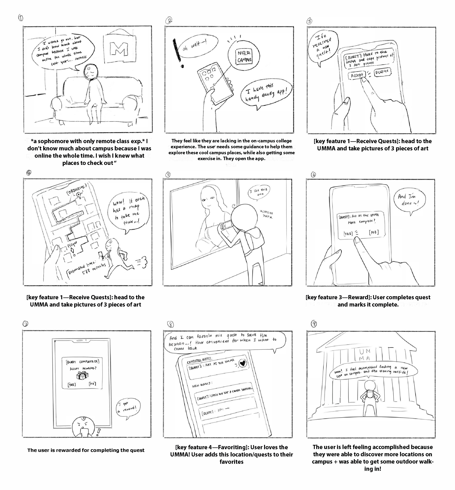
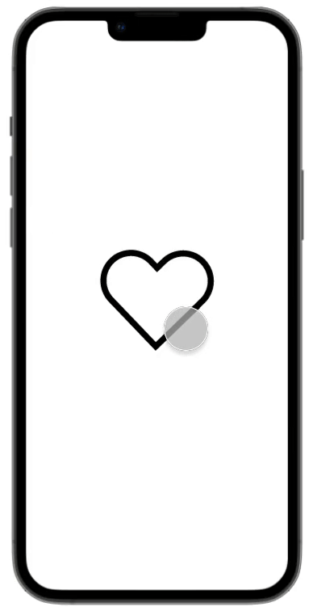
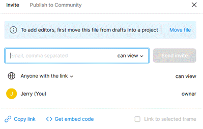

EECS 493 Assignment 4: Figma Prototype Development
======================================

| Total     | Released | Due                         |
| --------- | -------- | --------------------------- |
| 100 points| 10/9    |  **10/27 at 11:59 PM ET**  |

## Submission Instructions

Please submit a written report to Canvas as a .docx or .doc or .pdf.

Not following the upload instruction will result in a penalty.

## Assignment Objective

The objective of this assignment is to gain practical experience using Figma in developing a high-fidelity prototype and performing a heuristic evaluation of the prototype.

## Grading Breakdown

This assignment has 2 parts:

1. Develop a prototype based on a storyboard using Figma - *55 points*
2. Write a report - *45 points*
    - describing the Figma features you used in your prototype
    - evaluating your prototype using 3 of Nielsen's 10 usability heuristics

## Helpful Resources

1. **Figma Lecture recording/slides on Canvas** (very helpful)
2. Figma documentation on the specific features required in this assignment
    - [Constraints](https://help.figma.com/hc/en-us/articles/360039957734-Apply-constraints-to-define-how-layers-resize)
    - [Auto Layout](https://help.figma.com/hc/en-us/articles/5731482952599-Using-auto-layout)
    - [Components](https://help.figma.com/hc/en-us/articles/360038662654-Guide-to-components-in-Figma)
    - [Prototyping and Transitions](https://help.figma.com/hc/en-us/articles/360040314193-Guide-to-prototyping-in-Figma)
    - [Interactive Components](https://help.figma.com/hc/en-us/articles/360061175334-Create-interactive-components-with-variants)
        - [Variants](https://help.figma.com/hc/en-us/articles/360056440594-Create-and-use-variants)
3. [Free Icons](https://thenounproject.com/icons/) to use in your design
4. Additional video tutorials
    - [world's shortest Figma course](https://youtu.be/1pW_sk-2y40)
    - [Figma UI Design Tutorial](https://youtu.be/FTFaQWZBqQ8)

## Options

There are 2 options for completing this assignment.
1. Option 1: Use a storyboard we provided to build a Figma prototype with specific requirements (features/details) we defined.
2. Option 2: Use your own storyboard from your group project to build a Figma prototype with similar amounts of features/details as that of Option 1.

Option 1 provides more structure and guidance, and is recommended for those who are new to Figma. Option 2 offers more flexibility, and is recommended for those already experienced with Figma and would like more creative freedom. If you feel that Option 2 is too vague, we recommend you to complete Option 1 instead.

You should choose *only* one of the two options to complete.

## Storyboard

### Option 1

Use the following storyboard to design and develop your prototype.

Credit: Team Guzzi, Fall 2021.

### Option 2

Use a storyboard from your group project. Make sure to include your storyboard in your report when you are submitting your assignment to Canvas.

## Requirements

We outlined the requirements for each part of the assignment. **Everything listed below, unless labeled as "Suggested", is required.** Bullet points under "Suggested" will not be graded.

### Figma Prototype

This section describes the specific Figma requirements that your prototype must meet.

#### Mobile

The prototype should be designed for mobile devices. You may choose any mobile frame (e.g. iPhone 15, Google Pixel 6, etc.) you like to use in your prototype.

#### Figma Features

Other than the basic features like frames, texts, and shapes, which you have to use by default, you *must* also use the following Figma features at least once in your prototype:

1. Auto Layout
2. Constraints
3. Components
4. Prototyping (interactivity)
5. Interactive Components

#### Micro-Interaction

There should be an instance of micro-interaction present in the prototype. Read [this article](https://www.nngroup.com/articles/microinteractions/) for some examples. Be creative!

Remark: This micro-interaction should be different from the "add to favorites" in Frame 6.

#### Style
All frames should have appropriate & good style. Does not have to be complex; you just need to show that you have put in the effort in designing these frames.

#### Frames

The prototype should have the following 6 top-level frames.

**Frame 1**

- Display a list of new quests (i.e. quest names).
    - The quest names have to be written using meaningful texts instead of placeholders like "Lorem ipsum".
        - e.g. "Art at UMMA."
    - Hint: Try using components and auto-layout.
- After clicking on one (*and only one*) of the quests, it should navigate to Frame 2.

**Frame 2**

- Display only one quest in detail, including
    - a concise description of the quest
        - e.g. "Go to UMMA and take 3 pictures of art pieces you liked!"
    - a map showing the quest's location (destination)
    - distance/ETA
    - buttons to accept and decline the quest
- After declining the quest, it should navigate back to Frame 1.
- After accepting the quest, it should navigate to Frame 3.

**Frame 3**

- Display the current quest's details, including
    - a concise description of the quest
    - a map with a route to the quest's location (from the user's current location)
    - distance/ETA
    - a button to open the camera
    - a button to mark the quest as complete
- After clicking on the "mark the quest as complete" button (or something similar), it should navigate to Frame 4.
- Remark: the map does not have to be functional, i.e. actually figuring out the user's location.

**Frame 4**

- Display a message asking the user to confirm whether they have truly completed the quest.
    - Hint: This frame can simply be a pop-up that gets displayed over Frame 3. Try using Figma's "Open Overlay" feature.
- After the user confirms that the quest is truly completed, it should navigate to Frame 5.

**Frame 5**

- Display "Quest Completed!" and a "reward" given to the user.
- The user has to somehow be able to navigate to Frame 6.

**Frame 6**

- Allow the user to add a completed quest to their "Favorites".
- The user must be able to interact with some elements of the frame and then it should provide at least 1 clear feedback that the quest is now added to their "Favorites".
    - Example: User clicks on a dark "heart" icon next to a completed quest &rarr; "heart" changes to red or a piece of text gets displayed briefly saying "Added to favorites".
        - Remark: This is just an example; you may choose other ways to realize this feature.
    - Hint: Use an Interactive Component.
- The user has to be able to navigate back to either Frame 1 or Frame 2* depending on your design of this frame.
    - *This should technically be an "Alternate Version of Frame 1 or Frame 2" since a quest has just been completed by the user at this point in time. But for simplicity, you do not have to make a different version for Frame 1 or Frame 2.

#### Suggested

- Add more elements to any frame to get better usability.
    - e.g. a button to cancel the current quest
- Add more frames if you believe it can better demonstrate how a user navigates through your prototype.
- Explore additional Figma features in your prototype.

### Written Report

This section describes the specific requirements of the report, which has 2 main parts.

#### Figma Link

At the very beginning of the report, include a link to your Figma prototype with access type "can view".

Please make sure the link is working properly by opening it in an incognito/private window, and that clicking on the "Present" button will present your prototype which the user can interact with by clicking on certain elements on each frame.

Failing to do so will result in a *20% grade deduction*.

#### Length & Organization

The report should be short and concise, no longer than 600 words. *Points will be deducted* if your report is longer than 600 words. The word count requirement is not intended to work against you; it is to show that the report simply doesn't have to be that long.

Please use headings/subheadings to better organize your report.

#### Part 1

Briefly describe how you've used the 5 required Figma features in your prototype ***and*** what is the micro-interaction you created in your prototype.

- The 5 required features are listed in the [Figma Prototype](#figma-features) section.
- For each feature, simply describe 1 example of what you used it for in 1 or 2 sentences; same applies for the micro-interaction.
    - e.g. I used the "auto layout" feature in Frame #1 to vertically stack the quests on top of each other.
    - Suggested: Include a screenshot accompanying your written description.

#### Part 2

Evaluate your prototype using **3** of Nielsen's 10 usability heuristics.

For each heuristic you selected, provide 1 example in your prototype to briefly explain how it meets or doesn't meet the heuristic.

- i.e. For each example, you need to provide a screenshot and a short description.
- Please use the following template to structure each of your heuristic/example:
    - Heuristic Rule: 
    - Example screenshot:
    - Example description:
        - e.g. what the user might be doing in this screenshot
    - Does it support or violate the heuristic?
    - Reason:

Here are the 10 usability heuristics for your reference:

1. Visibility of system status
2. Match between system and the real world
3. User control and freedom
4. Consistency and standards
5. Error prevention
6. Recognition rather than recall
7. Flexibility and efficiency of use
8. Aesthetic and minimalist design
9. Help users recognize, diagnose, and recover from errors
10. Help and documentation

## FAQ

### I want to add some creativity to my design, making it slightly different from the spec, is this OK?

Yes, as long as all elements mentioned in the spec still exist in your design. If your design is too different from the spec, then please clearly indicate these differences either in your written report or as a comment on Canvas so graders can easily know where to look.

### What is the difference between microinteractions vs. interactive components?

Microinteraction is a design concept, which describes the minor yet important interactions that enhance user experiences and improves usability.

For instance, a button changing color being pressed, an animated progress bar showing the status of the machine. On the other hand, an interactive component is a feature of Figma. You can use this feature to implement a microinteraction in Figma.

You can implement whatever microinteraction you would like as long as you clearly describe it in your report.

### How is this assignment graded?

The grading will be lenient. You will receive full points as long as your Figma Prototype has all the required features.

### How do I design my prototype to be aesthetically pleasing?

The best way to create aesthetically pleasing designs is to look for examples online. Can you find a website or product that is aesthetically pleasing to you? If so, what aspects of their design can you take inspiration from? Try to incorporate them into your design!

## Acknowledgments
Original spec written by Zirui Zhao <zhaojer@umich.edu>.
Updated by the EECS 493 team.

This document is licensed under a [Creative Commons Attribution-NonCommercial 4.0 License](https://creativecommons.org/licenses/by-nc/4.0/). You're free to copy and share this document, but not to sell it.  You may not share source code provided with this document.
