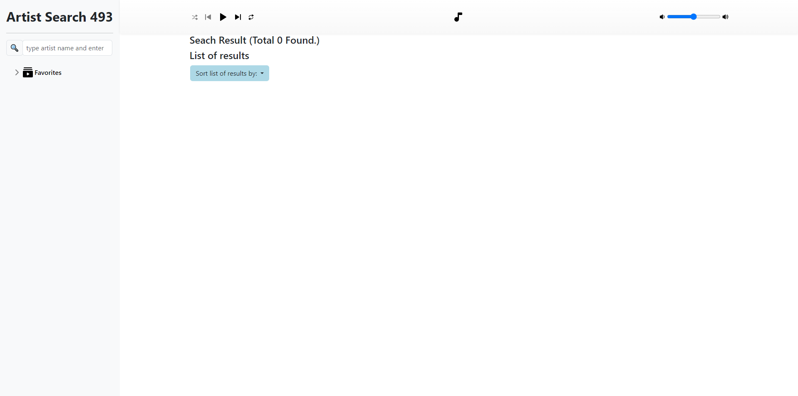
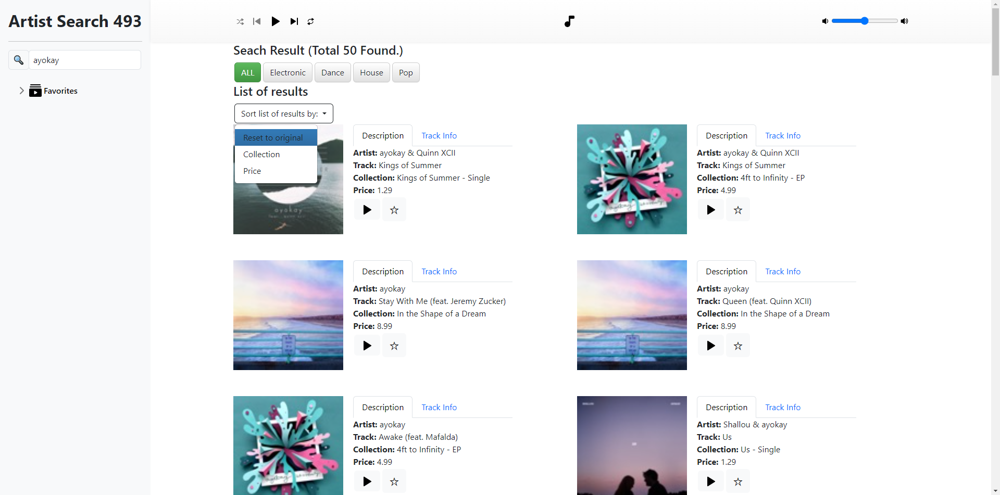
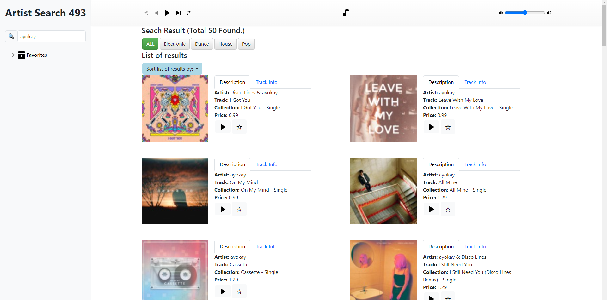
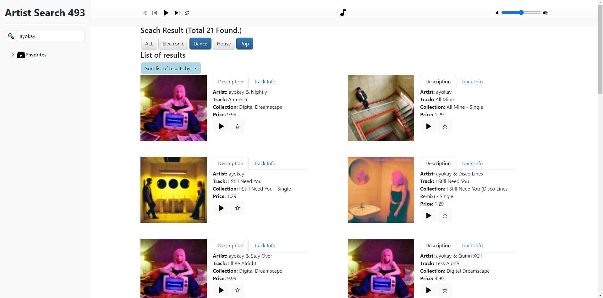
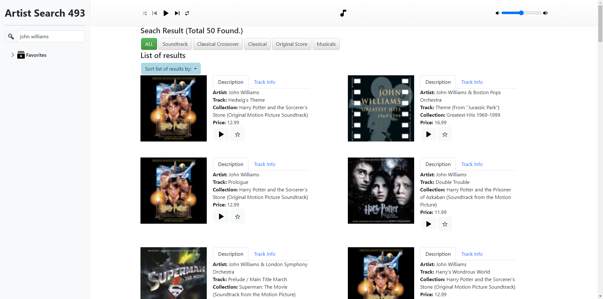
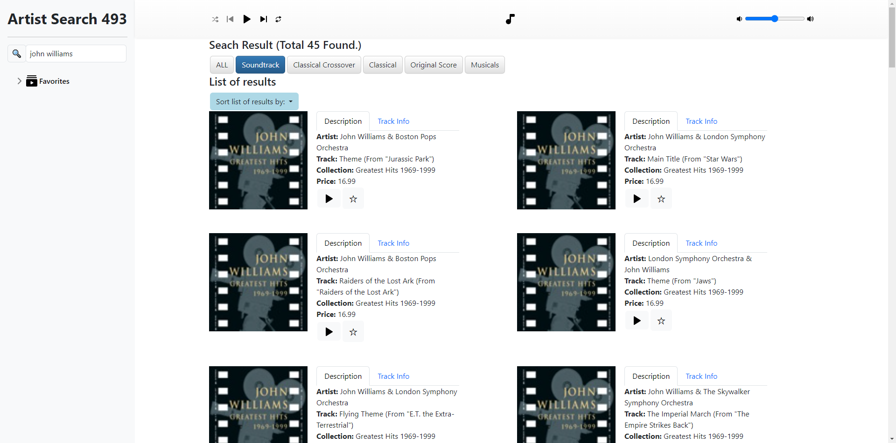

EECS 493 Assignment 5: Artist Search
======================================

| Total     | Released | Due                         |
| --------- | -------- | --------------------------- |
| 150 points| 3/13    | **4/6 at 11:59 PM ET**    |

## Submission Instructions

Please submit your work to Canvas as a zip file, named `a5_<uniqname>.zip`. Replace `<uniqname>` with your uniqname: e.g. `a5_zhaojer.zip`, note that the angle brackets should NOT be included in your filename. Renaming (e.g., "-1") done by Canvas is fine.

This zip file should have a *single directory* containing *all files and directories* provided in the starter code. In other words, the zip file should have the following structure.

```console
a5_uniqname
├── README.txt (OPTIONAL)
├── img
│   ├── 1.jpg
│   └── 2.jpg
├── index.css
├── index.html
├── loading.gif
└── script.js
```

Not following the upload instruction will result in a penalty.

## Assignment Objective

The objective of this assignment is for you to gain practical experience with the MVC pattern using Vue.js, a web application development framework, and Bootstrap, a CSS framework for responsive design. Specifically, you will create a website that searches for artists using the iTunes API.

Watch this video for an overview of this assignment: [https://youtu.be/uZ_q3TYPZTY](https://youtu.be/uZ_q3TYPZTY)

*Remark: The search results from the video may not be up to date. Please refer to the screenshots below for more recent, accurate results.*

## Grading Breakdown

The assignment has 6 main components and 1 optional component (denominator of 100 points):

1. Search Bar - *25 points*
2. Artists Grid - *30 points*
3. Navigation Tabs - *5 points*
4. Track Information - *5 points*
5. Genre Selection - *20 points*
6. Sort Menu - *15 points*
7. (Optional) Bonus Features - *up to 10 points*

## Starter Code

You will use the starter code we provide to complete this assignment.

Download and unpack the starter files (either using the following commands or simply navigating to the link).

```console
$ wget https://eecs493staff.github.io/a5-artist-search/starter_code.tar.gz
$ tar -xvzf starter_code.tar.gz
```

Here's a brief description for each of the starter files.

| `index.html` | HTML page **\[Write your HTML code in this file\]** |
| `script.js` | Placeholder for one Vue.js instance **\[Write your JS code in this file\]** |
| `index.css` | Additional customized style \[Do NOT modify this file\] |
| `loading.gif` | Show this gif while waiting for fetch \[Optional\] |
| `img/` | A directory containing 2 image placeholders \[Your final code won't need them\] |

Remarks

- You aren't required to use any of the starter code, but it's there to help you.
- Unless you know what you are doing, please do NOT modify anything inside the `<head>` tag in `index.html`.
- Please refer to Piazza for any modifications and clarifications.
- Make sure that your application (webpage) behaves properly on the latest version of Google Chrome. Your graders will use Chrome.
- To make sure your code runs correctly, it might be helpful to test it on a different computer.

## Helpful Resources

### iTunes API

- Constructing Search: <https://developer.apple.com/library/archive/documentation/AudioVideo/Conceptual/iTuneSearchAPI/Searching.html#//apple_ref/doc/uid/TP40017632-CH5-SW1>
    - Hint: Most useful parameters are *term* and *attribute*.
- Search Examples: <https://developer.apple.com/library/archive/documentation/AudioVideo/Conceptual/iTuneSearchAPI/SearchExamples.html#//apple_ref/doc/uid/TP40017632-CH6-SW1>
- Understanding Search Results: <https://developer.apple.com/library/archive/documentation/AudioVideo/Conceptual/iTuneSearchAPI/UnderstandingSearchResults.html#//apple_ref/doc/uid/TP40017632-CH8-SW1>

### Vue

- Get Started using createApp: <https://vuejs.org/guide/quick-start.html#without-build-tools>
- Vue Cheat Sheet w/examples: <https://www.vuemastery.com/pdf/Vue-Essentials-Cheat-Sheet.pdf>
- Template: <https://vuejs.org/guide/essentials/template-syntax.html>
    - Dynamically update HTML text using <code>&#123;&#123; &#125;&#125;</code>
    - Dynamically update HTML attributes using `v-bind`
    - Single JavaScript expressions can be used in <code>&#123;&#123; &#125;&#125;</code> for text and `" "` for attributes
- Binding Classes (`v-bind`): <https://vuejs.org/guide/essentials/class-and-style.html>
    - Dynamically toggle a class depending on certain conditions
- Conditional Rendering (`v-show`, `v-if`): <https://vuejs.org/guide/essentials/conditional.html>
    - Dynamically render a block (e.g. `<div>`) under certain conditions
- List Rendering (`v-for`): <https://vuejs.org/guide/essentials/list.html>
- Events (`v-on`): <https://v2.vuejs.org/v2/guide/events.html>
    - Listener
    - Method Handler
    - Modifier (prevent page from reloading)
    - Keyboard events (listening for specific keys)
- For making api calls, we can use the following. Both are supported in Vue 3.
    - `fetch`: <https://developer.mozilla.org/en-US/docs/Web/API/Fetch_API/Using_Fetch>
    - `Axios`: <https://axios-http.com/docs/example>

### JavaScript

- Object.keys(): <https://developer.mozilla.org/en-US/docs/Web/JavaScript/Reference/Global_Objects/Object/keys>
- Object.entries(): <https://developer.mozilla.org/en-US/docs/Web/JavaScript/Reference/Global_Objects/Object/entries>
- Array.prototype.sort(): <https://developer.mozilla.org/en-US/docs/Web/JavaScript/Reference/Global_Objects/Array/sort>
- Array.prototype.forEach(): <https://developer.mozilla.org/en-US/docs/Web/JavaScript/Reference/Global_Objects/Array/forEach>
- Arrow functions: <https://developer.mozilla.org/en-US/docs/Web/JavaScript/Reference/Functions/Arrow_functions>

### Bootstrap

- Intro: <https://getbootstrap.com/docs/5.3/getting-started/introduction/>
- Button (btn): <https://getbootstrap.com/docs/5.3/components/buttons/>
- Dropdown: <https://getbootstrap.com/docs/5.3/components/dropdowns/>
- Navigation tabs: <https://getbootstrap.com/docs/5.3/components/navs-tabs/>
- Grid System: <https://getbootstrap.com/docs/5.3/layout/grid/>

### Additional Tips/Hints

When trying to toggle the 'Description' and 'Track info.' tabs, take a look at [this tutorial](https://www.w3schools.com/bootstrap/bootstrap_ref_js_tab.asp) and play around with the code. Note how this can be achieved simply using Bootstrap and HTML.

Specifically, quoting directly from it: 'Add `data-toggle="tab"` to each tab, and add a `.tab-pane` class with a unique ID for every tab and wrap them in a `.tab-content` class.'

If you have trouble (e.g. clicking on 1 Description tab changes all Description tabs, or no matter which Description tab is clicked, only 1 Description tab changes), make sure the stuff bolded is implemented correctly. Put into context of our assignment, each 'Description' and 'Track info.' tab must have its own unique ID (i.e. `<div id='[something unique]'> </div>`). In other words, suppose there are 50 songs returned by the API call, then there will be 50 'Description' and 'Track info.' tabs, so we need 50 unique IDs for 'Description' and 50 unique IDs for 'Track info.'

Note: This is not the only way to achieve this behavior, but it is in my opinion the easiest way to do so.

## Screenshots

### Landing page with search bar



### After searching for an artist


### "Track Info." tab for the left two results


### Sort menu



### After sorting by "Collection Name"


### After sorting by "Price"



### After (resetting sort to original and) selecting the "Dance" and "Pop" genre selections



## Requirements

We outline the requirements for each of the components below. Everything listed in this section, unless labeled as "Suggested", is required. Please be sure to examine the overview video and screenshots to understand the expected behavior. Again, remember that your website does not have to look exactly like the one in the video/screenshots.

**Please read the [Helpful Resources](#helpful-resources) section for hints and learning resources.**

### General

Ground rules - *max 50 points off if not followed*

1. The primary point of the assignment is to use MVC pattern in developing the application using Vue.js. Therefore, reference and direct modification of HTML elements (such as `$(".class")`, `append()`, `document`) in JavaScript and jQuery are NOT allowed.
    - For example, using jQuery or JavaScript code that access HTML elements is NOT allowed (will result in significant deductions).
2. We've given you some starter code, and you'll only need to write JS code inside Vue instance(s) (in the JS file) and Vue directives in the HTML file.
    - We already created one Vue instance for you. You may add other instances if you prefer, but NO extra JS code should be written outside of Vue instances.
3. Every style-related element of the assignment MUST be done via Bootstrap. You are NOT allowed to use inline styling or define/use any custom CSS class/id other than the ones we provided in `index.css`.
    - i.e. Do NOT modify `index.css`
4. The provided `index.html` file includes (links to) jQuery, Bootstrap, Vue.js, and Axios.
    - In order for index.html to work properly, make sure you
        - Have internet connection,
        - Do NOT modify anything inside the `<head>` tag in `index.html`.
    - Note that `index.html` has some hard-coded data. This is just to show you an example, but the hard-coded data should eventually be replaced.
5. Follow the submission instructions at the beginning of the spec.
6. After unzipping your submission, the index.html file should work by directly opening it in Google Chrome, as long as there is an internet connection.
7. This assignment uses the iTunes API, which again requires internet access. Plan ahead if you will be in a situation that has no internet access. It is your responsibility to read the documentation and figure out the data structure of the JSON object.
8. This assignment requires online search and reading the documentation of Vue.js and iTunes API that we use. The assignment may include materials that are not covered in class. We believe that, in today's programming practice, searching and mining information from online materials is a significant part of a programmer's expertise.
9. Check out Piazza frequently for any changes or additional information.

### Search Bar (25 points)

- There is one input textbox provided in the HTML file.
- When a user types a keyword (i.e., an artist's name) and presses the "enter" key, the entered keyword is used to make an AJAX request to search for all tracks made by the artist(s) whose name contains (or is close to) this keyword.
    - Hint: Use `v-on:keyup` to check if the key was "enter (keycode:13)" or not.
    - Use either `Axios()` or `fetch()` for the AJAX call.
- The URL for the AJAX request and the returned JSON data are specified in the iTunes API documentation: <https://goo.gl/UXwDce>
    - Check out the [iTunes API section](#itunes-api) for a hint on which URL parameters you will need to get the correct results.
    - Note: Please do not include any additional URL parameters that may change/restrict the results; just leave them as the default.
- Print out the returned json object (i.e. `response.data`) in the console, using JS console.log(), when making requests for the APIs.
    - This should be the only thing that is printed in the console.
    - We will take off points if the above requirements are not met.
- When there are no artists returned from iTunes, alert the user, using JS alert(), that no artist was found with the keyword.
- "Total *N* found" message should display *N* = the total number of artists (results) returned by the iTunes API.

### Artists Grid (30 points)

- The returned artists should be displayed in two columns, where each result grid contains both an image and 5 types of related information displayed right next to each other (when the browser is in full size).
- One exception will be the last row that may have less than two artist grids depending on the number of artists returned.
- Please use the Bootstrap Grid system to accomplish the above requirements. Check out [this web page](https://getbootstrap.com/examples/grid/) for more detail. Make sure you understand how it works because it is a great way to realize layouts we learned from the class.
- When correctly implemented with Bootstrap, the layout will naturally be responsive (e.g. resizing the browser will automatically resize the images and the nav-tabs, and shift them to the next row).
- Typically, iTunes will provide an image URL for each artist. Use the first URL in the list in general.
- Note: We provided [screenshots](#screenshots) of the search result when a user searches for an artist. When unsure, please refer to these (and the project intro video), your web page should look pretty much the same as the one in the screenshot.

### Navigation Tabs (5 points)

- The returned artists should also have their information displayed next to them in the navigation tabs.
- Please use Bootstrap's nav-tabs (and other related classes) for this and next part (i.e. 4 and 5). Note that we already provided some example nav-tab code in the starter file. For more info, check out the Hints & Resources section.
- The 'Description' tab should contain: artist name, collection name, collection price, type (kind), and preview link. They can be found in the response JSON data.
    - If the price is not provided, set the price to 0.
    - Else, if one of the returned values is an empty string, display "No information provided" instead.
- Clicking the preview link should open the preview of the song (or any other media) from this artist in another tab or directly download it (both are fine).

### Track Information (5 points)

- When clicking the 'Track Info.' tab, the system should display the Track ID (which is a unique identifier) & Country for that particular search result.
    - You may assume that Track ID and Country are always going to be provided by the API.
- This means, whenever you click on the 'Track Info.' tab, the unique identifier will be different for each different 'Track Info.' tab you click on. See the [screenshots](#track-info-tab-for-the-left-two-results) section for an example.
- Hint: The key to getting this section to work is figuring out how to get only that particular div to change when you click on that 'Track Info.' tab. Check out the [Helpful Resources](#helpful-resources) section if you would like a more specific hint.
- When clicking back to the 'Description' tab, the five types of information should still be there.

### Genre Selection (20 points)

- Create a list of tags of which genre labels are available from the search results. (See screenshots/video above)
- As a user toggles a genre, only the artists that are categorized in the selected genre should appear in the grid.
    - The number of results should update as well.
    - You can select and deselect genres.
    - The genres selected should be indicated by the change in the background color.
- Once you select other genres besides ALL, the ALL button should be deselected, indicated by a change in its background color.
- Please use Bootstrap's btn (and related classes) for this part. Note that different button colors can and should also be achieved using Bootstrap. For more info, check out the Hints & Resources section.
- The genre selection works like a set union: The more genres that are selected the more results should be displayed.
- If ALL is selected, the other genres are deselected, and the results return back to the original list but maintaining the current sort selection. (see Sort Menu)
- The genre selected should automatically reset to ALL when you search for a new artist.

### Sort Menu (15 points)

- A "Sort list of results by: " button that displays a dropdown menu when clicked.
    - There are three options in the menu: 
        - Reset to original
        - Collection Name
        - Price
- For "Reset to original", reset the displayed results to the original order.
    - This should be the default selection.
- For "Collection Name", sort results alphabetically by collection name.
- For "Price", sort results by increasing price.
- For API results that did not return a Collection Name or Price, they should be sorted as if their Collection Name was "No information provided" and Price was 0.
- The selected option should be indicated by a distinct background color.
- Please use Bootstrap's dropdown (and related classes) for this part. Note that different background colors of the options can and should also be achieved using Bootstrap. For more info, check out the Hints & Resources section.
- When multiple genres are selected, the list of results should still be updated by the current sort selection (e.g., collection name or price).
    - In other words, when you select a genre, the sort option should not reset.
- The sort should automatically reset when you search for a new artist.

Here is another example of what the sort menu should look like and how it works.

In the dropdown menu, initially, it should be set as the "Reset to original"  indicated below by blue background.



When selecting a different option, it should be changed to that selection, for example, selecting "Collection Name", indicated by the blue background.


After an artist search and sorting by "Collection Name", then selecting different genres should still update the list by "Collection Name".

In other words, if the user sorts by Collection Name, it should update the list sorted by collection name; after that, if the user picks a genre, e.g. Anime, it should update the Anime list sorted by collection name too.



This should work when selecting any of the three sort options.

### Bonus (10 points max)

- This part is completely optional.
- If you have added any feature, please include README.txt file in the submission and explain what you implemented; otherwise we won't grade this task (this is the only time you are allowed to add a file to the directory structure).
- DO NOT CHANGE ANY EXISTING REQUIREMENTS FROM THE SPEC!
- Here is a video showing the expected behavior of the bonus section: <https://youtu.be/C8FJeIzlCVM>

#### Display a results list

Add a button next to the 'Sort list of results by:' button. Upon clicking, a popup should appear that displays all the track names returned by fetch grouped by the collection name.

#### Play

Add a "play" button to each of the 'Description' tabs.

After pressing the play button, it should start playing the song, and the text of the button should change from "play" to "stop". When the "stop" button is clicked, it should stop playing the song and revert back to "play".

## CORS Header

When doing this assignment, you might run into your search results being rejected with a "CORS" message. This error is largely server-side, so there is no simple solution. The success of the request will change depending on what browser you are using, if you are hosting the page on the server, and the configuration of the iTunes server the artist you are requesting is stored on.

One solution that often works is adding `&origin=*` to the end of your search query. This will often resolve the error if you are running your code directly from a file.

There are other ways that might help if you still encounter this issues:
- Test with an artist that isn't the one shown in the example video. We suspect that iTunes has changed the way it processes requests coming from the UMich wireless network for the example artist, since there are suddenly several hundred identical requests every minute in the exact same format from the exact same location. Suggesting a different artist to search would be self-defeating, but you should be testing your implementation with a variety of artists anyway.
- Ordering matters in the iTunes API call, so you can play around with the ordering of your added keys to the query.
- Do not open the file as a local server (`localhost:XXXX/<file path>`). Some IDEs may automatically open HTML files in a server rather than opening the raw file in a browser (`<filepath>`); opening it as a raw file may stop it.

Again, many of these errors are configuration dependent. If you continue to have issues, please come speak to us in office hours or post on Piazza.

## FAQ

### Sometimes, the search result seems unrelated to the search keyword, is this fine?

Yes, as long as you are correctly using the 2 query parameters listed in the [iTunes API](#itunes-api) section.

### When I minimize the window to the minimum width, the text in one artist grid overlaps with the next artist grid, is this fine?

Yes.

### Should our search results match exactly the ones in the spec?

Not necessarily, since API results change from time to time. As long as you make sure you are using the 2 (and only those 2) parameters in the [iTunes API](#itunes-api) section, you should be all set.

## Acknowledgments
Original spec written by Zirui Zhao <zhaojer@umich.edu>.
Updated by the EECS 493 team.

This document is licensed under a [Creative Commons Attribution-NonCommercial 4.0 License](https://creativecommons.org/licenses/by-nc/4.0/). You're free to copy and share this document, but not to sell it.  You may not share source code provided with this document.

