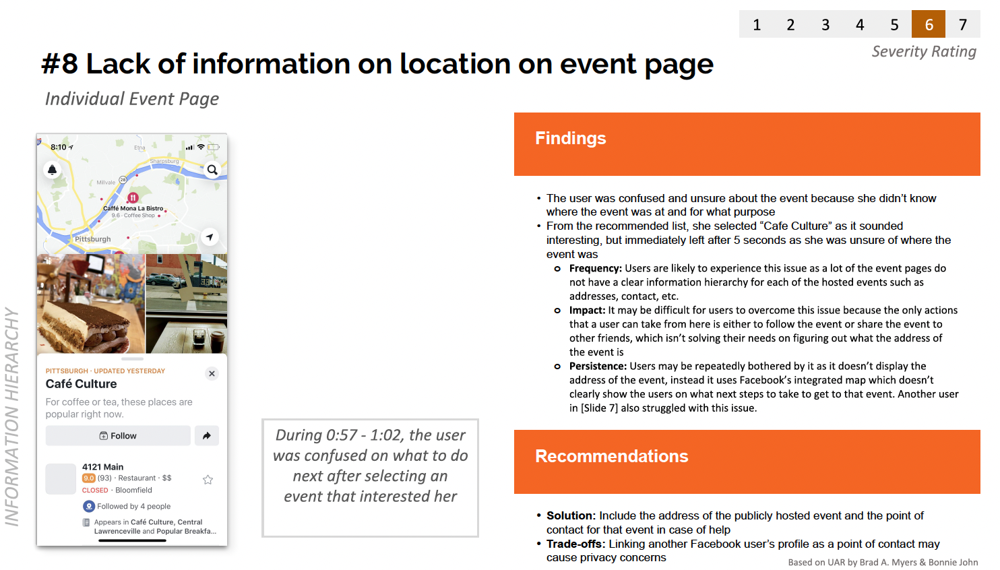
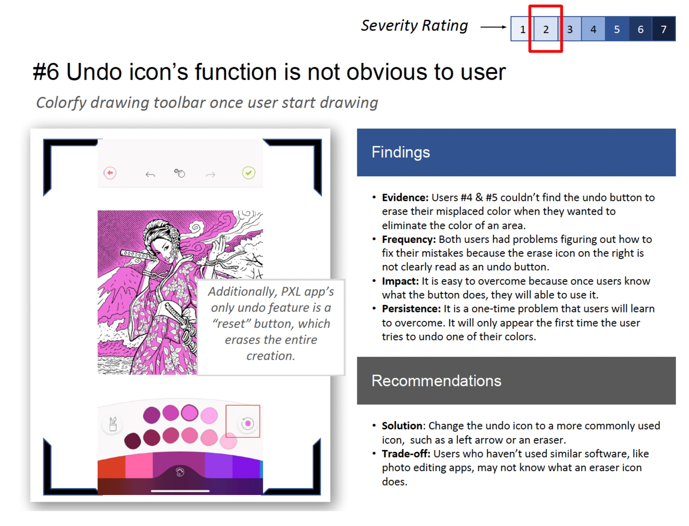

# EECS 493 Final Project Spec

# Project Overview

Throughout the semester, you’ll be working together on a team project that follows the user-centered design process. This project makes up 25% of your total course grade. You will submit milestones at different stages of the project, and the detailed timeline is provided below.

## Project Theme

Your team will come up with your own project theme, with the only restriction being that the stakeholder group should be people you can easily have access to, e.g., other undergraduate students. You can find a list of final project examples below.

## Detailed Timeline

| Milestone                                                                                                             | Due date                          | Task / Objective                                                           |
| --------------------------------------------------------------------------------------------------------------------- | --------------------------------- | -------------------------------------------------------------------------- |
| [**Milestone 0**](https://eecs493staff.github.io/final-project/#milestone-0) **Team Formation**                    | Sun 9/21 11:59 PM                 | - Team membership                                                          |
| [**Milestone 1**](https://eecs493staff.github.io/final-project/#milestone-1) **Need Identification**               | Sun 10/5 11:59 PM                 | - User need - Break point                                               |
| [**Milestone 2**](https://eecs493staff.github.io/final-project/#milestone-2) **Ideation & Speed Dating**           | Fri 10/17 10:30 AM (before class) | - In-class storyboard showcase                                             |
|                                                                                                                       | Fri 10/24 11:59 PM                | - Storyboards - Speed dating with 4 users - Written report           |
| [**Milestone 3**](https://eecs493staff.github.io/final-project/#milestone-3) **Prototype & Evaluation**            | Sun 11/9 11:59 PM                 | - High-fi Figma prototype                                                  |
|                                                                                                                       | Sun 11/9 11:59 PM                 | - First user evaluation using think-aloud with 2 users - Written report |
| [**Milestone 4**](https://eecs493staff.github.io/final-project/#milestone-4) **Iterate on Prototype & Evaluation** | Wed 11/19 10:30 AM (before class) | - User need - Break point                                               |
| [**Final Presentation Video**]()                                                                                      | Wed 12/3 10:30 AM (before class)  | - Final Video                                                              |
| [**Evaluation Report**]()                                                                                             | Wed 12/7 11:59 PM                 | - Evaluation Report                                                        |

<!-- TODO: To release milestone add link to corresponding document -->
<!-- For example, [**Milestone 0**](https://eecs493staff.github.io/m0-team-formation/) -->

<!-- | Due date                                                                     | Task / Objective                                                      |
| ---------------------------------------------------------------------------- | --------------------------------------------------------------------- |
| [**Milestone 0**](https://eecs493staff.github.io/final-project/#milestone-0) | **Team Formation**                                                    |
| Sun 9/21 11:59 PM                                                            | Team membership                                                       |
| [**Milestone 1**](https://eecs493staff.github.io/final-project/#milestone-1) | **Need Identification**                                               |
| Sun 10/5 11:59 PM                                                            | User need + break point                                               |
| [**Milestone 2**](https://eecs493staff.github.io/final-project/#milestone-2) | **Ideation & Speed Dating**                                           |
| Fri 10/17 10:30 AM (before class)                                            | In-class storyboard bakeoff                                           |
| Sun 10/19 11:59 PM                                                           | Storyboards + speed dating with 4 users + written report              |
| [**Milestone 3**](https://eecs493staff.github.io/final-project/#milestone-3) | **Prototype & Evaluation**                                            |
| Sun 11/9 11:59 PM                                                            | High-fi Figma prototype                                               |
| Sun 11/9 11:59 PM                                                            | First user evaluation using think-aloud with 2 users + written report |
| [**Milestone 4**](https://eecs493staff.github.io/final-project/#milestone-4) | **Iterate on Prototype & Evaluation**                                 |
| Wed 11/19 10:30 AM (before class)                                            | User need + break point                                               |
| [**Final Presentation Video**]()                                             |                                                                       |
| Wed 12/3 10:30 AM (before class)                                             | Final Video                                                           |
| [**Evaluation Report**]()                                                    |                                                                       |
| Wed 12/7 11:59 PM                                                            | Evaluation Report                                                     | -->

# Milestones

## Milestone 0: Team Formation

| Due date           | Task / Objective                           |
| ------------------ | ------------------------------------------ |
| Sun 9/21 11:59 PM  | Team registration form / team finding form |
| Thur 9/25 11:59 PM | Team registration form for assigned teams  |

| Resource                                                      | Description                                                |
| ------------------------------------------------------------- | ---------------------------------------------------------- |
| [Team Registration Form](https://forms.gle/x9itCsb9UCqgsbfk8) | Register your teams here                                   |
| [Team Finding Form](https://forms.gle/5G7CpkLgL7JjW1rR6)      | Fill this out, if you would like us to form a team for you |
| [Project Team Spreadsheet (Te be released)]()                 | A detailed list of all project teams for this semester     |

### Goals

- Form a team of 4 members (either self-selected or assigned by the course staff).
  - If you formed your own team, fill out this [Team Registration form](https://forms.gle/x9itCsb9UCqgsbfk8).
  - If you would like us to form a team for you, fill out this [Team Finding form](https://forms.gle/5G7CpkLgL7JjW1rR6). - We will form teams for you _after_ the due date; after you are assigned to a team, your team will have 2 days to submit the Team Registration form.
  <!-- - [Link to Project Team Spreadsheet](https://docs.google.com/spreadsheets/d/1CiBZJ0HrOh0kTuRdP52OXtMO5anVlp9M1FgPJECg9Ho/edit?usp=sharing). -->

### Team Membership

Teams should ideally consist of **4** members.

- If you select your own team:
  - You need to submit a list of team members via the [Team Registration form](https://forms.gle/x9itCsb9UCqgsbfk8).
  - _Please only submit 1 form per team._
- If you choose to have us assign you to a team.
  - You have to fill out a [Team Finding form](https://forms.gle/5G7CpkLgL7JjW1rR6) describing yourself, e.g. strengths, time available to work, etc.
  - Please note that if you choose this option, you will be assigned to a team _after the due date_, and your team will have **2 days** to submit the Team Registration form, i.e. slightly behind on the project.

### Additional Notes for Team Formations

- _You are welcome to use Piazza’s search for teammates feature, or try to meet new people in class or discussion\!_
- You should aim for a team of **4**. A team of 3 will be expected to do the _same_ amount of work as a team of 4\. A team of 5 will be expected to take on _additional work_\.
- Aim for diverse skills (e.g., design/drawing, interviewing, Figma).
- **_All members must be present for the Storyboard Showcase, Prototype Showcase, and Final Presentation._** Absent member(s) will receive a 4% deduction from the final project grade for each absence.
- If conflicts with team members arise, notify the staff promptly. Grading will be based on deliverables as a group.

### Choosing a Project Theme

- Propose your project theme in the Team Registration form.
- The only requirement: your stakeholder group must be accessible to you (e.g., other undergraduate students).

## Milestone 1

(Worth 20% of final project grade, 5% of total grade)

| Due date          | Task / Objective             |
| ----------------- | ---------------------------- |
| Sun 10/5 11:59 PM | All Milestone 1 deliverables |

| Resource                                                                                                                                 | Description                                                                |
| ---------------------------------------------------------------------------------------------------------------------------------------- | -------------------------------------------------------------------------- |
| [Example Interview Transcripts](https://drive.google.com/drive/folders/1-AsWH_iViz05R_HTR-6t6ROWJ6OVaDhN?usp=sharing)                    | Exemplar interview transcripts from previous semesters                     |
| [Example Interview Background and Design Document](https://docs.google.com/document/d/1pZtlWHEsu2YXwLK51_aheKRxTHcse4lA2AVYnUC3Ew0/edit) | Exemplar interview background and design documents from previous semesters |

### Deliverables

Submit the following **as one zip file on Canvas**.

1. A folder with clean transcripts following the format of [the example transcripts](https://drive.google.com/drive/folders/1-AsWH_iViz05R_HTR-6t6ROWJ6OVaDhN?usp=sharing). There should be two transcripts per team member.
2. A spreadsheet with 70+ interpretation / white notes.
3. A pdf/image file of the affinity diagram. You can do this on paper + whiteboard (we recommend printing out the notes on paper rather than writing), or on a digital platform like Mural or Miro. Make sure all texts are legible. You need to have at least 70+ white notes, 18-24 blue notes, 6-12 pink notes, and 3-4 green notes.
4. Interview Background and Design Document: A document with background information about the interview (including procedure, goals, and context), interview questions, and a demographic table of participants.
5. Written Report: An up to 700-word written report of up to two user needs and two break points your team have identified in a .docx.

### Overview: User Need & Break Point Discovery

The goal for this milestone is to identify authentic user needs that will drive your product design. You'll conduct your own interviews and transcribe them following the format of [our provided example transcripts](https://drive.google.com/drive/folders/1-AsWH_iViz05R_HTR-6t6ROWJ6OVaDhN?usp=sharing), particularly the primary example (A1: Improving undergraduate students' career development experiences) that the teaching staff has carefully annotated.

For additional guidance, we've provided four more sets of interview questions from previous semesters covering diverse themes:

1. A2: A business communication platform that simplifies interaction across groups
2. A3: Empowering undergraduate students to make informed and affordable sustainable consumer choices
3. A4: Mood tracking for undergraduate students
4. A5: Gamified study planning app to improve undergraduate students’ productivity

For each theme's first interview transcript (P1), the teaching staff has annotated strengths and weaknesses in the question design, which should help you craft your own interview questions.

### Interview Requirements

Each team member should conduct at least 2 interviews, with each session lasting 20-30 minutes. After conducting interviews, transcribe and clean your transcripts for submission.

### Analysis Process

Based on your transcripts, identify **_up to two_** user needs and two break points, using the techniques for synthesizing qualitative data from lectures (e.g. affinity diagram). To generate robust insights for your final project, aim to create as many notes as possible from the transcripts. The minimum requirements are:

- 70+ white notes
- 18-24 blue notes
- 6-12 pink notes
- 3-4 green notes

You'll also create a spreadsheet with interpretation notes and a final affinity diagram for this submission. The format and content should follow the examples from lecture 8 and discussion 4. We've provided student submissions from previous semesters for each of the 5 projects listed above in the folder: [\[SHARED\] Example Transcripts](https://drive.google.com/drive/folders/1-AsWH_iViz05R_HTR-6t6ROWJ6OVaDhN). Each example includes instructor comments highlighting areas for improvement.

Additionally, prepare a document with (1) background information, (2) how you conducted interviews, (3) your interview questions, and (4) a participant demographic table. Refer to this document [Example Interview Background and Design Document](https://docs.google.com/document/d/1pZtlWHEsu2YXwLK51_aheKRxTHcse4lA2AVYnUC3Ew0/edit) for an example.

### Grading Rubric

You will be graded on:

- 70 Interpretation notes well distributed among participants (3 pts)
- Quality of interpretation notes (3 pts)
- Quantity of blue, pink, and green notes (3 pts)
- Quality of blue, pink, and green notes (3 pts)
- Written Report (2 pts)
- Interview Design Document (6 pts)

<!-- ### Looking Ahead: Milestone 2

Once you've identified user needs and break points, you'll move into the ideation phase where you'll brainstorm solutions using IDEO methods, create storyboards to visualize your concepts, and validate them through speed dating sessions with users. -->

## Milestone 2

| Due date                  | Task / Objective                      |
| ------------------------- | ------------------------------------- |
| Thursday 10/16 Noon       | In-Class Project Showcase Signup Form |
| Friday 10/17 Before Class | Storyboards                           |
| Friday 10/24 11:59 PM     | Zip file of all deliverables          |

### Links and Resources

- [In-Class Project Showcase Signup Form](https://docs.google.com/spreadsheets/d/1Djt5nAKSAfBFfW5EQYDlsJSsvILPZvdeMrE6nxSLl0M/edit?usp=sharing)
- [Team Information and Staff Contacts](https://docs.google.com/spreadsheets/d/1vlR6NFx0BtoyG4j1o6L60EnJh1Eq198TExkuvydATtI/edit?usp=sharing)

### Goals

- Ideation (8%)

  - Brainstorm as many solutions as you can using the IDEO Ideation method taught in class among your team.
  - Based on these ideas, group and filter them down to a subset of 8-10 ideas that will be used for creating your storyboards.

- In-class Project Showcase (4%)

  - In your class on Friday 10/17, we will host an in-class storyboard session to help you ideate better. We will organize the class to facilitate in-class feedback for our project by fellow students.
  - Please complete the “In-Class Project Showcase Sign-up Form” by NOON, 10/16 (Thursday).

- Speed dating (8%)

  - Speed date the storyboards with at least 4 potential users in order to
    - Validate the user need
    - Get feedback on the proposed solutions
    - Figure out the final design you want to implement in the next step

- Deliverables: You need to submit the following as one zip file on Canvas.
  - A PDF of a list of at least 80 ideas your team came up with using the IDEO ideation method, and also a subset of 8-10 ideas your team picked for storyboarding.
  - A PDF including all of your storyboards.
  - A PDF/image of the post-it notes you collected during in-class project showcase.
  - Transcripts or notes for at least 4 speed dating sessions (please do not submit the original recordings).
  - A written report of your method, findings, and final design idea (~700 words, not strict)

### Ideation

In the ideation step, you need to first brainstorm at least 80 ideas/solutions to the
user need(s) you identified in Milestone 1. And then, you need to pick 8-10 ideas to
be ferreted out using the storyboards. These ideas can cover one of the identified
user needs or both. This is to say, you can probe storyboards for two different
user needs as a way to validate which one is more relatable to target users. These storyboards
should help you present your ideas visually, without any specific UI designs/implementations.

Here is a rough template (please see lecture for more examples):

- Scenario with a persona (illustrate the user need): 1 panel
- Solution (illustrate how the user need is resolved): 1-2 panels
- Outcome (illustrate the result of the resolution): 1 panel
- For each storyboard, you also need to write two leading questions which show what question you will ask during the speed dating session. (see lecture for examples)

You will present these storyboards for speed dating and in the in-class project showcase. For Canvas submission, take a screenshot/picture of your storyboards and put them into one document.

### Speed Dating

Then, you need to make sure that the user need you have identified is real and narrow down your solutions. You will perform speed dating with at least 4 potential users, analyze the results, and write a brief report.

Assuming you have 8-10 storyboards, each speed dating session should take less than 30 minutes, during which you should present all of your 8-10 storyboards. We encourage each team member to perform one speed dating session and you will then come together to synthesize the results.

#### Speed Dating Procedure

- Speed date with at least 4 potential users using the storyboards you have created.
  - You are responsible for finding your participants.
  - Each team member needs to perform at least one speed dating session.
  - The speed dating session can be done in person or over Zoom (where you can share your screen).
- You will present each storyboard, explain what’s happening.
- Here are some suggestions of questions that you can ask the participants:
  - **Need validation**
    - Have you been in a similar situation before?
    - Does the scenario reflect an authentic situation you’ve been in before?
  - **Attitudes towards solution**
    - Can you share your thoughts on the solution proposed?
    - What aspects of the technology/solution do you find compelling?
    - What are your concerns about the solution proposed?
    - Would you use this technology in your own [specific context, e.g., business, work, project]?
    - How can this technology/solution be made more suitable for your context?
    - Include your solution-specific questions.
- Please note that the above are suggestions. You can use your own questions. In the
  final report, you need to include at least one question for need validation, and at least
  one question to gather thoughts on the solution. Feel free to re-use the options above.
- If the participant consents, recording the session is encouraged. Please then use
  transcription services such as Zoom Cloud Recording to get the transcript, and modify it
  when necessary.
- If the participant does not consent, please take deliberate notes throughout the session.
- You should clean up the transcripts before submitting to us. Please follow the format as
  the previous transcripts we've provided in A2 and Milestone 1. Please do not upload the
  recordings themselves.

#### Analyzing Data from Speed Dating and Presenting your Findings

- Summarize your findings from the 4 speed dating sessions.
- You can use a method of your choice, such as affinity diagramming.
- Specifically, your goal is to answer the questions including:
  - Is the user need real?
  - Why is this an important problem to solve?
  - What challenges do people face in similar situations?
  - What design solution do you converge on for the next step based on the speed dating findings?

### In-Class Project Showcase

The class on 10/17 will be devoted to live critiques, and in short rounds (e.g. ~20 minutes for each round), several teams at a time will post their storyboards on the wall or lay them out on tables around the room. We assume many teams haven’t started running the speed dating sessions yet. Please use this as an opportunity to get feedback to improve your storyboards.

**Make sure to bring your printed storyboards for this showcase!**

Please complete the “Storyboard Session Sign-up Form” linked under “Goals” heading BY NOON ON 10/16.

#### Here's what will happen at the in-class storyboard session:

- There will be a list of team assignments for each round.
- For each round:
  - **If you are presenting your team's storyboard in that round:**
    - Post all pages of your storyboard at the station.
    - You must have one additional blank page available for post-its.
    - Stand at your station to explain your storyboard and take comments.
    - One person gets the job of notetaker to write down all the great ideas you're given.
    - At the end of the session, take a picture of the post-it notes page(s) your team gathered and submit to Canvas as part of your Milestone 2 submission.
  - **If you are not presenting:**
    - Your job is to go make other group's projects better.
    - Go see the other team's storyboards.
    - Ask questions that help you to understand it (not to critique it).
    - Make suggestions on how to make it better.
    - You are also encouraged to learn from the other teams' great ideas!
    - Leave your suggestions on post-it notes on the extra page with the team.

## Milestone 3

(Worth 20% of final project grade, 5% of total grade)

### Goals

- Prototype (12%)
  - Design & implement a high-fi prototype using Figma
- Evaluation (8%)
  - Perform at least two user tests regarding the usability of your prototype using the
    think-aloud protocol.
  - Synthesizing the results using usability findings templates.
  - Write a report describing the usability issues discovered from the user test, and
    summarize a list of things to fix.
- Link to Assignment: Canvas Assignment
- Due Date: Nov 9, 11:59 PM

### Prototype

For the prototype step, your team will design and build a high-fidelity prototype using Figma.

- The prototype should be built using Figma, instead of web/app technologies (e.g., HTML,
  CSS, Javascript, Swift, etc.).
- The prototype should have a significant amount of work or details. **Compared to
  Assignment 4, your prototype should have at least 4 times the amount of work or details for a team of 3 or 4 and 5 times the amount for a team of 5.** This
  includes but not limited to the number of frames, features, functions, supported
  interactions, and more.
  - We will primarily evaluate this from the perspective of "tasks"/"critical user
    journeys", i.e., a sequence of user interactions your prototype supports for users
    to accomplish one of their primary goals. For example, in Assignment 4, you
    designed a task of favoriting, accepting and completing quests (i.e., engage with
    and complete a quest). This task contains a series of subtasks, including
    browsing quests, viewing quest details, favoriting a quest, accepting a quest,
    completing a quest, receiving rewards, etc, where the user could perform one or
    multiple interactions to complete the subtasks.
  - For this milestone, your prototype should support 2 key tasks, with at least 8
    subtasks per task. Subtasks need to be part of the task rather than just a
    combination of different features.
  - Both tasks need to support the same goal (e.g., "improve resume") and the goal
    should not be too general (e.g., "find a job", since there will be many directions
    you can go under this goal). If your task has less than 8 subtasks, it may indicate
    the task is too specific (e.g., "favorite the quest", "accept the quest").
  - The task should be key goals users need to accomplish using your prototype,
    such as 1) sign up for a career fair event, find it on your calendar, and cancel it,
    or 2) carry out a consultation session with an AI agent to do a mock interview and
    provide feedback (with many conversation turns to concretely achieve
    something). In the context of Gmail, a task would be to compose and send an
    email, or create a folder and sort emails into it, where each of them would include
    a series of steps and interactions.
  - Unless highly relevant and really needed, we want to discourage you from
    prototyping or design tasks for obvious things that already exist, such as account
    management related tasks.
  - You are welcome to send us a link of your prototype as you go, or come to office
    hours, and we'll be able to give you suggestions on whether they feel sufficient or
    not.
- You can use and build on external templates, but please document them clearly of what
  is from others, what is from you, when making the submission on Canvas.
- A link to your Figma prototype should be submitted on Canvas by the due date.
- Please describe your tasks, subtasks in the report as a separate section.

### Evaluation

#### User Test

After building the prototype, your team will have to evaluate it by performing a user test with at least 2 people, who will attempt to use your prototype without much prompting, while
thinking-aloud. Here are the specific requirements:

- You need to have at least 2 users. You are responsible for finding your participants. You could have more than 1 team member to run the user test so that everyone on your team will have the opportunity to experience the think-aloud.
- After each user testing session, please iteratively improve your prototype. The changes
  after each iteration should be discussed in the final report.
- You should use the key tasks your prototype supports for the users, but keep the
  instruction on a high level without specifying each subtask step the user needs to take.
  - The goal of this evaluation is to test your prototype's usability, so you should give
    users the high-level task and let them figure out how to navigate the UI elements.
    You want to cover all functionalities of the prototype and progressively getting
    more difficult.
  - Example: - Sign up for a career fair event, then cancel it from the calendar (easy) - Carry out a consultation session with an AI agent to do a mock interview
    and provide feedback (hard). - Note that these tasks shouldn't be too granular such as "favoriting" or
    "accepting quest" or "completing quest" as separate tasks.
- The users should do think-alouds as they try to use the prototype to perform the tasks.
  - Please follow the think-aloud protocol from lecture and check the lecture slides if
    unsure.
  - Test your prototype on the platform it's designed for. If you are designing a mobile
    app, then run it on a mobile phone (try open in Figma mobile app). If you are
    designing a desktop website, then run it on a desktop browser. Consider context.
- Remember to screen record the user tests, so that you can analyze the audio and
  screen recordings afterwards to detect usability issues.
- If you find it difficult to do in-person testings, here are some alternatives:
  - You can share your prototype with them using Figma's share feature, then you
    can ask the user to use it while sharing their screen in Zoom (or any other video
    conferencing system).
  - You can use Zoom screen sharing and give your participants remote control
    access, so they can interact with the prototype directly in Zoom.
  - If you used Zoom to record, please enable audio transcription in order to save the
    transcripts.
- Write up usability findings based on the usability findings template (UFT). Each team
  should submit at least 6 UFTs for this milestone. (namely 3 UFTs per think-aloud)

Link to usability findings template: [Usability-Finding-Template](https://docs.google.com/presentation/d/1JSe47wi4CQ8hsiYn-m9dZGBkaqEHIlS4oxM3grqjz1w/edit?usp=sharing)

Example 1:

Example 2:

#### Deliverables (please put everything in a zipped folder and submit):

1. Link to the Figma prototype (check permission so anyone can view)
2. The think-aloud tasks (list the tasks you used in the think-aloud sessions)
3. UFTs based on the templates
4. Cleaned think-aloud transcripts, one per session (transcript only, no video)
5. A 1-page report (~700 words) describing your findings in .docx:
   - Connect the findings from the UFTs, what are some most serious problems with
     your prototype and what are some positive experiences you observed during the
     think-aloud tests.
   - Describe what changes you've made during the iterations, and what needs to be
     done next to the prototype in order to improve its usability.

### Rubrics for Milestone 3

You will be graded on:

- Basic requirements for the prototype [9 points] (e.g., is the prototype developed using Figma? Does the prototype support at least 2 key tasks? Are tasks relevant to user goals and the team's project themes?)
- Quality of the prototype (e.g., are think-alouds useful and thorough?) [3 points]
- Think Alouds and UFTs [5 points]
- Written Report [7 points]

## Milestone 4

(Worth 28% of final project grade, 7% of total grade)

### Overview

| Due date                     | Task / Objective                      |
| ---------------------------- | ------------------------------------- |
| Tuesday 11/18 Noon           | In-Class Project Showcase Signup Form |
| Wednesday 11/19 Before Class | Iterated Prototopes                   |
| Sunday, 12/7 11:59 PM        | Zip file of all deliverables          |

### Goals

- **Iterate on The Prototype (14%)**

  - Improve your prototype by addressing the design and usability issues discovered from Milestone 3.
  - Link to Project Feedback Form: [Project Feedback Form (template)](https://docs.google.com/document/d/1ESHmK_hDI1SRG_0suQUUuyxveGGQ06BNx8curxahVIQ/edit?usp=sharing) (but check for updates)
  - Due Date: Nov 19 before the In-class Showcase
    - You don't need to submit anything before the bake-off. You only need to bring your prototype and the project feedback form sheet to bake-off.
    - Note: you can and should continue improving your prototype after the showcase session.

- **Iterate on The Evaluation (10%)**

  - Perform another user test regarding the prototype & the user need using the think-aloud protocol.
  - Synthesizing the results using usability findings templates.
  - Write a report discussing your findings.
  - Due Date: Sunday, Dec 7, 11:59 PM

- **In-Class Project Showcase (4%)**
  - Date: Wed Nov 19 in class
  - Signup by Nov 18 noon
    - Link to signup sheet: [EECS493 F25 Final Project Showcase Signup](https://docs.google.com/spreadsheets/d/101HlpHqTgMtFTUFINDao9EomwN9ARUhqEWy1i5JcrQs/edit?usp=sharing)

### Iterate on the Prototype

In this milestone, you will incorporate the design and usability findings and your proposed changes from milestone 3, prototype showcase to improve your Figma prototype.

To start, make a copy of [Project Feedback Form (template)](https://docs.google.com/document/d/1ESHmK_hDI1SRG_0suQUUuyxveGGQ06BNx8curxahVIQ/edit?usp=sharing) and fill it out with the 2 key tasks of your prototype that will be demonstrated during the showcase session. We will use this template to test your prototype and give suggestions, and you can use these suggestions (along with any feedback you received along the way) to further improve your prototype before conducting user testing sessions.

- Similar to Milestone 3, we are not going to objectively measure the amount of work based on the number of screens, UI elements, etc. Think about it from the perspective of **"tasks", "critical user journeys"** can help. In this milestone, you should have **2 key tasks**. For example, in Assignment 4, you designed a task of favoriting, accepting and completing quests (i.e., engage with and complete a quest). This task contains a series of subtasks, including browsing quests, viewing quest details, favoriting a quest, accepting a quest, completing a quest, receiving rewards, etc, where the user could perform one or multiple interactions to complete the subtasks.

- Note that tasks and prototype requirements in Milestone 3 still apply in Milestone 4, including having an appropriate scope for the task, avoiding implementing widely used existing functionality such as account management, and more. Please see the "Prototype" section in Milestone 3 for more information.

- After the project showcase session, please incorporate the feedback you received from the teaching staff (specifically from the project feedback form) and other students to further improve the prototype.

- You will submit a list of changes you have made to the prototype, along with screenshots showing the changes. In the list of changes, please also indicate the source of the improvement if applicable, e.g., changes proposed in milestone 3, feedback gathered from the showcase session, etc.

You will create a document to record the prototype iteration process, it must contain the following:

- A link to your improved Figma prototype.
- A list of changes you have made to the prototype.
  - This should include the proposed future improvements (i.e., next steps) from your Milestone 3 report, feedback the team received from the showcase session, and feedback from the milestone 3 grading.
- For each change, include a screenshot(s) of the prototype that clearly shows the change.

### Iterate on the Evaluation

#### User Test

After improving the prototype, you will have to evaluate it again by performing another user test using think-aloud, but this time the goal is to investigate to what extent your solutions help the users achieve their goals and address their needs. Here are the specific requirements:

- You need to have at least **4 users** for the test. Ideally, they should not be the same people from the first user evaluation (from Milestone 3).

  - NOTE: If you have a team of 3 or 4, you need to have at least 4 users. If you have a team of 5, each team member needs to do at least 1 (i.e., at least 5 in total).

- You should use the tasks you designed in your prototype.

- The rest of the requirements are the same as those of the first user evaluation, including following the think-aloud protocol and synthesizing the results using usability findings templates.
  - Each team should submit at least **2 UFTs/user × 4 users = 8 in total**. For teams of 5, at least 10 in total.

#### Report

You will write a ~700 word report discussing your findings. Here is an outline of the report:

**Findings regarding the utility of the solution:**

- How did the changes you made after milestone 3 improve the design and usability?
- Discuss your findings regarding the usefulness of your current solution, using what you get from the user tests with think-alouds, the UFTs you created
- What are some most serious problems with your prototype and what are some positive experiences you observed?

**Analysis:**

- Based on your findings, answer the following questions:
  - To what extent the solution is solving the problem and addressing the user need?
  - What part of the problem can not be solved by the solution? What else is needed, if any?
- Use relevant quotes, observations, and UFTs to support your analysis.

### Deliverables

Please put everything in a zipped folder and submit:

1. Link to your Figma prototype
2. Your prototype iteration document
3. The think-aloud tasks (list the tasks you used in the think-aloud sessions)
4. At least 8-10 UFTs based on the templates (depending on your team size)
5. At least 4-5 think-aloud transcripts depending on your team size (only need to submit the transcript, no video is needed)
6. Your report

**Grading Rubric:** to be provided

### In-Class Showcase

An in-class showcase session for the prototype will take place on **Nov 19** during the class time (10:30am - 12:00 pm), during which our teaching staff will provide feedback to your prototype.

**To prepare for the Final Project Showcase Day, please complete the following BY NOON Nov 18:**

- Sign up for the showcase: [EECS493 F25 Final Project Final Showcase Signup](https://docs.google.com/spreadsheets/d/101HlpHqTgMtFTUFINDao9EomwN9ARUhqEWy1i5JcrQs/edit?usp=sharing)

  - It asks for your team name, your uniqnames (separated by commas), and asks you to print and bring a copy of your filled out Project Feedback Form.

- Make a copy of "Project Feedback Form (template)". Fill out your team's basic information and the first column of the table. Print it out, and bring it to class.

**During the showcase day:**

- We'll have ~13 stations per round, with a total of 4 rounds
- A teaching staff will go to your station and evaluate your prototype based on the key user tasks. The staff will use the feedback form to fill in comments based on their experience.

## Final Presentation Video

(Worth 12% of final project grade, 3% of total grade)

### Goals

- Summarize and present the entire design process in a 5-minute video (hard limit)
- Due Date: Wednesday 12/3 before class

### Final Project Video

For the final milestone, your team will make a 5-minute (300s) video of your project, summarizing the entire design process. We will devote the classes on 12/3 and 12/5 to this. For each team, we will play your video, then have a brief Q&A.

The video should include content from past milestones:

- User need and break point discovery (~40s)
- Ideation, Storyboarding, and the solution (~40s)
- A walkthrough or demo of your **final** prototype (~150s)
- Evaluations and iterations: what are the evaluation results for each iteration? What are the key issues you identified? And how did you improve the prototype based on these results? (~60s)
- Ending screen: your team, name/uniqname/photo of each team member

**Note: this is a video, not a presentation. Be creative, tell a story. Think beyond using slides.**

Please also sign up for the final presentation using the [Final Project Video Sign-up Sheet](https://docs.google.com/spreadsheets/d/19mIGPkto1ggO2GeQu7btcrsy07SV5ZGdABGR0T8xQwk/edit?usp=sharing) by **Wed 12/2 NOON**.

- It asks for your team name, your uniqnames, and a YouTube link to your video.
- Each lecture section has 13 slots, with 6 minutes for each slot (in order).
- The video is a maximum of 5 minutes (hard limit), and please make sure to check
  permission so we can play it in class. Please put it up on YouTube (public or
  unlisted).
- During your 6 minutes window, we'll play your video, and your team must be present and
  come to the front
  - If some of your team members have approved reasons for not making it in
    person (need approval, email us of your reason), please join Zoom to join your
    team.
- For the other day that you are not presenting, you are required to be present to watch
  other teams' videos (you can either join in person or via Zoom).

For the Canvas submission, you should upload the video as an MP4 file. You will turn this in on
Canvas as a team (ie, one per project team). You may include the video as an mp4 or as a zip
file. You may also include any slides (in PDF) used in your video. If you do this, include it in the
zip file.

Grading rubric:

- 2 points: A clear and understandable video
- 1 point: The user need and your solution
- 7 points: Your prototype's capabilities and interactions
- 2 point: key issues and how you have addressed or will address them

See examples in the Appendix 1 below (though the time limit was different). Also refer to ones
we showed in Lecture 19: HCI Research.

## Mandatory: Project Team Peer Evaluation

Final project team peer evaluation form will be made available soon.

Note: fill this out individually, not in groups.

This form is designed to let us know if certain team members are not contributing their fair
share. Each person must fill out this form. Note, the idea is that shirkers will get penalized in
their final project grade; however, you cannot raise your grade by "dinging" someone else.

## You Did It!

Thank you for all the effort you have put into this project! We are excited to see how everything comes together. If you have any questions about the project, please feel free to let us know or post it on Piazza. Thanks!

# Awesome Final Projects from Past Semesters

## Winter 2025

- StudyScout: <https://youtu.be/h8W3WvK1x8s>
- Broke but Woke: <https://youtu.be/R76cEL5xrVI>
- Notionairy: <https://youtu.be/gEyuubPOfOg>
- The Sweats: <https://www.youtube.com/watch?v=gfeK_lRBMXM>
- Pixel Penguins: <https://www.youtube.com/watch?v=ElFLOTaTQBo>

## Fall 2024

- rota: <https://youtu.be/uoK-ry9dNps>
- Dream Team: <https://youtu.be/4aoBE29ejw0>
- Pathfinders: <https://youtu.be/0ierk4q-2X8>
- Munchies: <https://youtu.be/5FE_CT4h4UI>
- The Department of the Exterior: <https://youtu.be/EpLP3sDPayE>

## Winter 2024

- Ecowarriors: <https://youtu.be/4Rj1ZjC0eNI>
- Productivity Pals: <https://youtu.be/-9xAUY1srDY>
- Mood Mobile: <https://youtu.be/m-gWpTrQHSU>
- Error 493: <https://youtu.be/qm9u8UXryaU>
- Xiaolongbao: <https://youtu.be/GfLDJhg9GbU>
- Binary Beasts: <https://youtu.be/ehC0HBSm5YU>
- JSON Voorhees: <https://www.youtube.com/watch?v=7av5kOd8xLQ>
